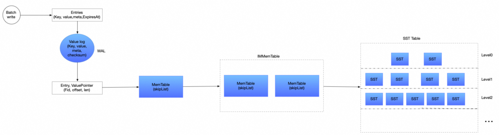

+++
date = '2025-03-04T00:26:07+08:00'
draft = false
title = 'Badger的GC初步探究'
+++

类似 RocksDB， badger 是 Go 基于 LSM 实现的 KV 数据库。本文介绍基于 badger 的 1.62 版本。 与传统的LSM 不同，对于 value 数据，badger 会写入 value log，来减少写放大和读放大。但是也会造成问题，就是磁盘会占用过多。 value log 的 gc 实现的比较简单。

我们先看下 badger 写入链路。

1. 数据会优先写入 value log , 这里实际当成了 WAL 使用
2. value pointer 会记录 写入 value log 文件的 fid ,offset, len
3. 然后把数据写入 memtable ,如何memtable 数据写满的话，会变成不可更改的 memtable , 然后写入到 SST Tables 中。

那么何时刷新 memtable ， 目前有两种情况：

- 一个是 memtable 大小控制，超过 memtable 规定的大小，就会刷新。默认是 64M , 通过WithMaxTableSize 可以指定
- 在一个通过 LogRotatesToFlush 控制，这个参数是说 写入 value log 的文件轮转了多少次，默认是 2 次。 超过这个数值也会刷新。

当 badger 进行重启的时候，会对部分数据进行回放操作。从哪个点的数据进行回放，是通过 head pointer 实现的。 head pointer 记录了 fid 和 offset ， 数据比这个 head pointer 晚的话，都会进行回放。

head pointer 是如何更新的呢？是通过 memtable 刷新的时候，写入 sst table 时更新的。那么如果 badger 重启的时候，key 还在 memtable 中的数据会被回放。这些数据写入 value log 的位置肯定比 head pointer 晚。那么为了控制回放时，读取的value log 数据不会太多，通过 LogRotatesToFlush 来控制 额外读取 value log 的文件数量。

badger 的 value gc 的回收，可以类似下面的代码触发

    go func() {
    		ticker := time.NewTicker(1 * time.Minute)
    		defer ticker.Stop()
    
    		for range ticker.C {
    			fmt.Println("gc", time.Now())
    		again:
    			err := db.RunValueLogGC(0.5)
    			if err != nil {
    				fmt.Println(err)
    			} else {
    				goto again
    			}
    		}
    
    	}()

这里GC 实现的逻辑比较简单：

1. 找到要 gc 的 文件列表
2. 随机选取某个文件进行 gc， 实际上进行数据采样，通过 RunValueLogGC 传入的阈值进行比较，是否有足够的空间可以释放
3. 如果可以释放，进行重写，实际上把要保留的数据通过 write 接口重新写回到 badger 中

如何找到 gc 的 文件列表是关键的一步。上文提到的 head pointer 就起作用了。head pointer 所在的 fid 已经之后的fid 都会被排除出去，也就是说 head pointer 对应的 fid 之前的可以作为 gc 的文件列表。那么之后的是无法进行 gc 回收的。

举个例子说明，下面是典型的 badger 数据库的目录。假设 head pointer 对应的 fid 是 110， 那么可以回收的文件列表就是 101 ~109 。然后进行上面的 2,3 步操作。

刷新 memtable 有两种方式，如果尽可能使用第一种方式，那么 head pointer 就会指向最新的 vlog 从而尽可能回收vlog 文件，减少磁盘的利用。那么可以通过：

- 适当减少 memtable size ，比如改成 32M
- 适当减少 value log 的大小，默认是 1G, 可以调整成 256M
