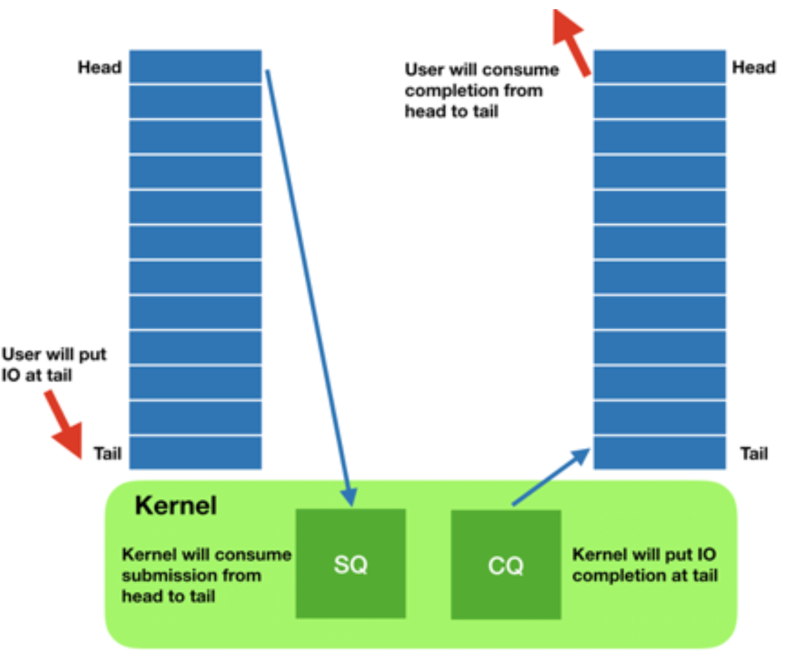

+++
date = '2025-10-22T21:34:32+08:00'
draft = false 
title = 'io_uring 学习'
searchHidden = true
ShowReadingTime =  true
ShowBreadCrumbs =  true
ShowPostNavLinks =  true
ShowWordCount =  true
ShowRssButtonInSectionTermList =  true
UseHugoToc = true
showToc = true
TocOpen = false
hidemeta = false
comments = false
description = ''
disableHLJS = true 
disableShare = false
hideSummary = false
tags = ['linux', 'io_uring']
+++
io_uring 是 Linux 内核提供的异步 IO 接口，它可以用于替代传统的同步 IO 接口，如 `read`、`write` 等。io_uring 提供了一种基于事件循环的异步 IO 模型，能够在单个线程中处理多个 IO 操作，从而提高 IO 操作的并发性和效率。io_uring 从内核5.1版本开始引入，在这之前，AIO 提供了异步IO 的功能。但是存在诸多的限制，包括       

* 只能作用于文件IO, 不能作用于网络IO. 在文件IO 中，只能使用O_DIRECT标记打开文件，无法使用buffer cache 。这样使用的范围比较少，只有在数据库领域有应用。
* 不能完全提供异步功能，如果元数据不可用时，也得同步等待
* 不能完全做到zero-copy
* 在某些设备场景中，无法做到真正异步，也得同步等待

io_uring 使用统一的接口解决异步IO问题，包括文件IO 和 网络IO。非阻塞的接口，减少了线程上下文的切换。并且可以使用系统的buffer cache 。
io_uring 主要的数据结构包括两个ring buffer 。


* Submission Queue (SQ)：用于提交IO请求的环形缓冲区。应用程序将IO请求放入SQ中，内核从SQ中获取请求并处理。 IO 请求放入tail 中， 内核通过head 读取进行处理。
* Completion Queue (CQ)：用于存储IO操作完成的结果。内核将IO操作的完成结果放入tail中，应用程序从head中获取结果并处理。

io_uring 提供一系列系统调用的接口，目前可以通过[liburing](https://github.com/axboe/liburing) 库来更方便的使用。

在这个库的examples 目录下自带了很多的使用例子。具体的例子也可以通过[这里](https://unixism.net/loti/tutorial/index.html)有更多的解释。

## liburing-cp 
这是一个文件IO的例子，使用liburing 实现的 cp 命令。从[这里](https://github.com/axboe/liburing/blob/master/examples/io_uring-cp.c) 看到最新的代码。

初始化 io_uring 实例， entries 是 SQ 的大小， 一般设置为 2 的幂次方。 通常情况下CQ 是SQ 大小的2倍。

```c
static int setup_context(unsigned entries, struct io_uring *ring)
{
	int ret;

	ret = io_uring_queue_init(entries, ring, 0);
	if (ret < 0) {
		fprintf(stderr, "queue_init: %s\n", strerror(-ret));
		return -1;
	}

	return 0;
}
```

queue_read 用于提交读请求。 io_uring_get_sqe 是初始化提交请求条目，io_uring_prep_readv 是初始化读请求。 读请求时通过IO向量来指定的。`data->iov.iov_base = data + 1;` iov_base 记录了读请求的起始位置。是在 io_data 后面分配的内存大小。`io_uring_sqe_set_data` 是将 io_data 关联到 sqe 中。
```
static int queue_read(struct io_uring *ring, off_t size, off_t offset)
{
	struct io_uring_sqe *sqe;
	struct io_data *data;

	data = malloc(size + sizeof(*data));
	if (!data)
		return 1;

	sqe = io_uring_get_sqe(ring);
	if (!sqe) {
		free(data);
		return 1;
	}

	data->read = 1;
	data->offset = data->first_offset = offset;

	data->iov.iov_base = data + 1;
	data->iov.iov_len = size;
	data->first_len = size;

	io_uring_prep_readv(sqe, infd, &data->iov, 1, offset);
	io_uring_sqe_set_data(sqe, data);
	return 0;
}
```

`io_uring_submit` 是提交 SQ 中的请求到内核,这时候批量提交的读请求才会被内核处理。

`io_uring_wait_cqe` 阻塞调用，等待CQ中出现完成的请求。如果有完成事件，函数返回。当有事件返回时， `io_uring_peek_cqe` 非阻塞调用，用于获取CQ中的完成事件。如果没有完成事件，函数返回 -EAGAIN。

```
if (!got_comp) {
				ret = io_uring_wait_cqe(ring, &cqe);
				got_comp = 1;
			} else {
				ret = io_uring_peek_cqe(ring, &cqe);
				if (ret == -EAGAIN) {
					cqe = NULL;
					ret = 0;
				}
			}
```
`io_uring_cqe_get_data` 获取完成事件关联的 io_data。 如果`cqe->res == -EAGAIN` 说明当前请求还没有完成，内核取消了，或者中断了。需要重新提交。 `(size_t)cqe->res != data->iov.iov_len` 说明当前请求只读取了部分数据，需要调整 IO 向量，重新提交。

```
data = io_uring_cqe_get_data(cqe);
			if (cqe->res < 0) {
				if (cqe->res == -EAGAIN) {
					queue_prepped(ring, data);
					io_uring_submit(ring);
					io_uring_cqe_seen(ring, cqe);
					continue;
				}
				fprintf(stderr, "cqe failed: %s\n",
						strerror(-cqe->res));
				return 1;
			} else if ((size_t)cqe->res != data->iov.iov_len) {
				/* Short read/write, adjust and requeue */
				data->iov.iov_base += cqe->res;
				data->iov.iov_len -= cqe->res;
				data->offset += cqe->res;
				queue_prepped(ring, data);
				io_uring_submit(ring);
				io_uring_cqe_seen(ring, cqe);
				continue;
			}
```
提交写请求，这是IO向量已经是读请求后的数据了，可以直接使用此向量提交写请求。
```
static void queue_write(struct io_uring *ring, struct io_data *data)
{
	data->read = 0;
	data->offset = data->first_offset;

	data->iov.iov_base = data + 1;
	data->iov.iov_len = data->first_len;

	queue_prepped(ring, data);
	io_uring_submit(ring);
}
```
## 总结
通过上面的实际例子，总结下liburing 中主要函数的使用。      

* `io_uring_queue_init` 初始化 io_uring 实例, 主要是指定队列的大小。
* `io_uring_get_sqe` 获取 SQ 中的提交请求条目。
* `io_uring_prep_readv` 初始化读请求。
* `io_uring_prep_writev` 初始化写请求。
* `io_uring_sqe_set_data` 将 io_data 关联到 sqe 中。
* `io_uring_submit` 提交 SQ 中的请求到内核。
* `io_uring_wait_cqe` 阻塞调用，等待CQ中出现完成的请求。
* `io_uring_peek_cqe` 非阻塞调用，用于获取CQ中的完成事件。
* `io_uring_cqe_get_data` 获取完成事件关联的 io_data。
* `io_uring_cqe_seen` 标记 CQ 中的完成事件为已处理。

## 参考
* [https://medium.com/oracledevs/an-introduction-to-the-io-uring-asynchronous-i-o-framework-fad002d7dfc1](https://medium.com/oracledevs/an-introduction-to-the-io-uring-asynchronous-i-o-framework-fad002d7dfc1)
* [https://www.bilibili.com/video/BV1JB4y1R7QY/?spm_id_from=333.1007.top_right_bar_window_history.content.click&vd_source=e91f1e0e2fd6e7afd65d0e39c8cb3c68](https://www.bilibili.com/video/BV1JB4y1R7QY/?spm_id_from=333.1007.top_right_bar_window_history.content.click&vd_source=e91f1e0e2fd6e7afd65d0e39c8cb3c68)
* [https://kernel.dk/io_uring.pdf](https://kernel.dk/io_uring.pdf)