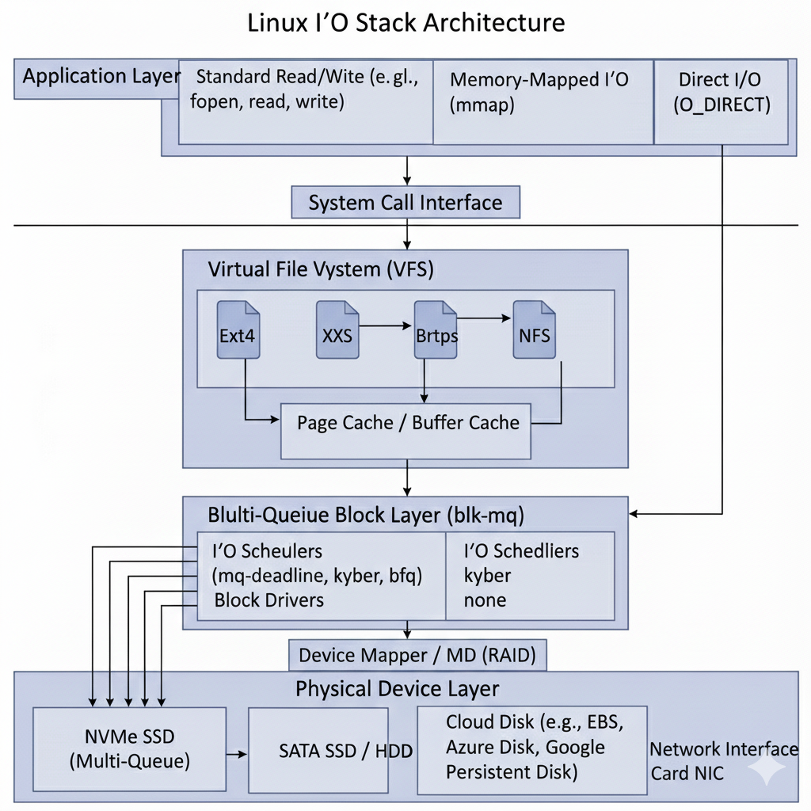
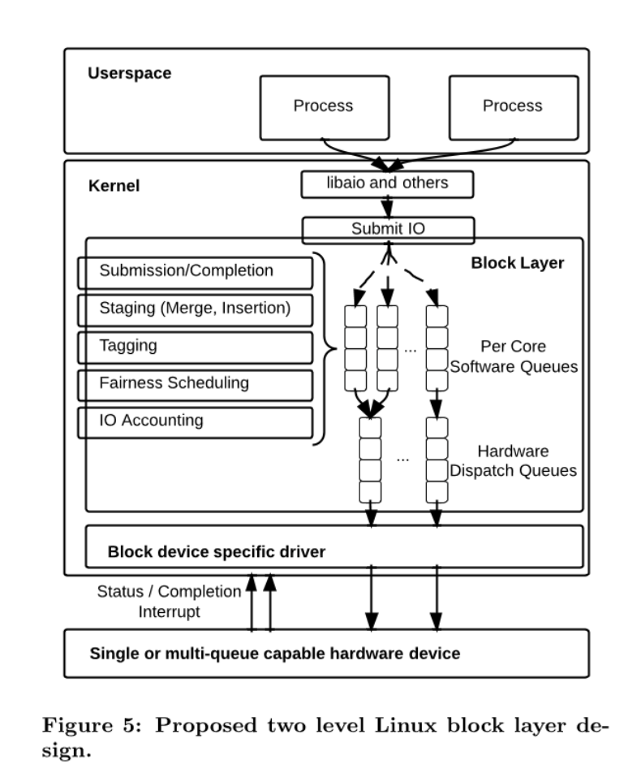
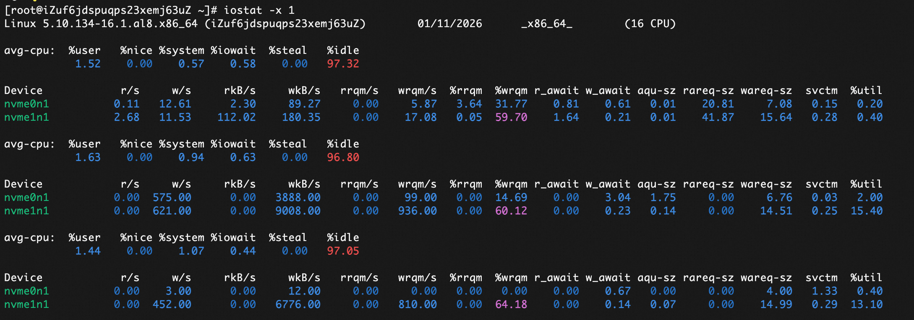
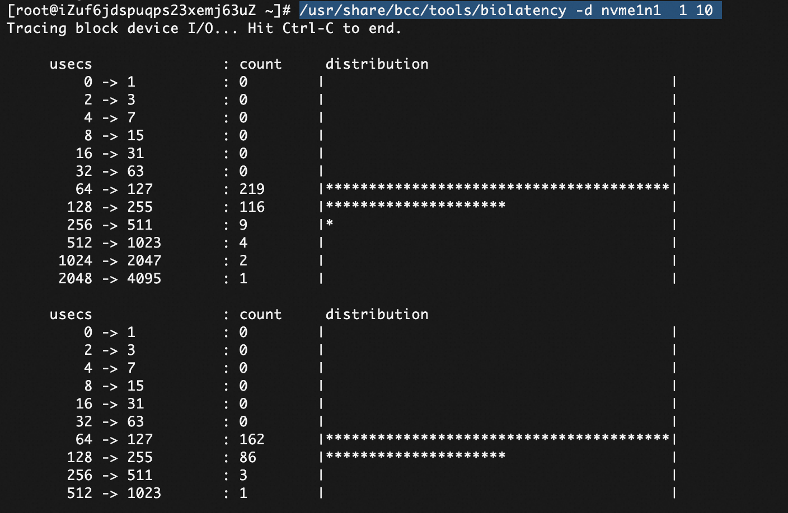
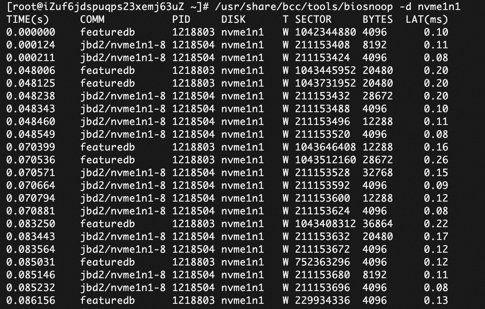

+++
date = '2026-01-11T18:27:08+08:00'
draft = false
title = 'Linux IO Stack 分析及调优实践'
searchHidden = true
ShowReadingTime =  true
ShowBreadCrumbs =  true
ShowPostNavLinks =  true
ShowWordCount =  true
ShowRssButtonInSectionTermList =  true
UseHugoToc = true
showToc = true
TocOpen = false
hidemeta = false
comments = false
description = ''
disableHLJS = true 
disableShare = false
hideSummary = false
tags = ['linux', 'io']
+++

本文首先介绍Linux IO Stack 的整体链路，然后结合相关工具，跟踪IO的性能，并且根据实践中的场景，介绍如何进行IO的调优。

## Linux IO Stack 


### 文件读写的方式

根据上图，我们总结下文件读写的几种方式。 

1. 使用标准库的文件读写函数

直接根据文件描述符进行读写。先说明写数据的情况。主要两种情形：
* 在不使用Fsync 的情况下，实际写入Page Cache 就成功返回。 后续会由内核的线程异步将数据刷入磁盘。在系统内存充足的情况下，写入速度很快。但是内存紧张的情况下，可能涉及脏页的写入&内存的页替换，会有延迟的情况。如果写完数据，立即进行读取的话，速度也会很快，读取也是优先从Page Cache 读取。

* 如果涉及到WAL日志文件，防止意外断电情况下的数据丢失，会使用Fsync进行写入。这时也会写入到Page Cache ，但是会阻塞，直到提交到块IO，并且完成实际磁盘设备的写入才返回。这里有个优化的点，可以使用DSync 的模式，这样只会写入数据，而不进行元数据的更新，从而减少IO的调用。

在数据读取时，会先从Page Cache 读取。如果Page Cache 中没有，才会从磁盘读取。读取的性能一般会很高，尤其是顺序读取的情况下。 系统会进行预读，从而提前加载数据到Page Cache。

2. 直接IO (O_DIRECT)

在打开文件时，设置 O_DIRECT 标志位，即可开启直接IO。Direct IO 的写入，不会经过Page Cache， 直接进行块IO的提交。这里会减少系统内核函数的调用。简化IO链路。这里不会涉及预读，需要上层应用控制。比如数据库软件都会使用Direct IO 来进行文件读写。

O_DIRECT 的写入，需要内存地址的对齐，以及IO的大小也需要对齐。否则会报错。

这里也可以单独设置Fsync的标志，如果没有设置，提交到块IO就返回了。否则需要等待磁盘的写入完成才返回。

3. 使用 mmap 系统调用

mmap 系统调用可将文件映射到进程的虚拟地址空间，允许通过内存指针直接读写文件内容。
当使用 MAP_SHARED 模式写入时，数据会修改内核的 Page Cache 中对应的页面，并将其标记为“脏页”。
随后，内核的回写线程（如 flusher）会在后台异步地将这些脏页写入磁盘。
若需确保数据已持久化，应用程序应显式调用 msync()。

使用mmap 实现了零拷贝的（Zero Copy）机制，避免了数据在用户空间和内核空间之间的复制。 在读取文件时，使用 mmap 的方式居多。 当读取文件时，在内存中不存在的情况下，触发缺页中断，加载之后再返回。当内存紧张时，内存页可能被换出。 在mmap打开的内存地址，可以进行madvise调用，灵活的调整访问方式。

上面介绍的几种读写方式都是同步IO的方式，如果使用异步AIO，可以参考io_uring的使用，[这里](../io_uring-learn)有介绍,即使使用AIO,也同样复用上图的IO Stack。

### Block Layer
不管是通过Page Cache， 还是Direct IO， 最终都是提交到块IO。当数据写入到Page Cache 后，达到一定的阈值(内核脏页占比，内核脏页字节数量，过期时间)等等，会有内核线程把数据提交到块IO。在现代Linux内核中，块IO是由MQ(多队列)实现的。



在Block层，包含两个队列，软件队列和硬件队列。 每个磁盘设备都会有软硬件队列。软件队列和CPU核心数相关的，每个CPU核心都对应一个软件队列，这样减少了锁共享和提高了缓存的局部性。由软件队列提交到硬件队列，是由IO Schedu 调度策略控制的，但是在云环境中，策略是none。也就是不经过任何处理，直接转发到硬件队列。下面命令查看磁盘的调度策略。

```
cat /sys/block/nvme1n1/queue/scheduler 
[none] mq-deadline kyber bfq
```

## IO 性能检测
### iostat 
使用 `iostat` 命令可以检测磁盘的IO性能。 可以查看磁盘的读写速度，以及IO队列的长度。可以查看多个磁盘的性能情况。 

```
iostat -x 1
```



| 字段 | 含义 |
|------|------|
| `r/s` | 每秒读请求数（read per second） |
| `w/s` | 每秒写请求数（write per second） |
| `rkB/s` | 每秒读取的 KB 数（千字节/秒） |
| `wkB/s` | 每秒写入的 KB 数（千字节/秒） |
| `rrqm/s` | 每秒合并的读请求数（合并相邻请求以减少实际 I/O） |
| `wrqm/s` | 每秒合并的写请求数 |
| `%rrqm` | 合并读请求占总读请求数的比例（= rrqm / (r/s + rrqm)） |
| `%wrqm` | 合并写请求比例 |
| `r_await` | 平均每次读操作的等待时间（毫秒），包括队列等待和实际处理时间 |
| `w_await` | 平均每次写操作的等待时间（毫秒） |
| `aqu-sz` | 平均队列长度（average queue size），即平均有多少个 I/O 请求在等待处理 |
| `rareq-sz` | 平均每个读请求的大小（KB） |
| `wareq-sz` | 平均每个写请求的大小（KB） |
| `svctm` | 服务时间（service time） —— 每个 I/O 请求在设备上实际处理的时间（毫秒），注意：这个值是估算的，不是真实测量值 |
| `%util` | 设备利用率（Device Utilization）—— 设备忙的时间百分比，最大为 100% |

我们要理解下 %util 这个指标。这个是时间的指标，就算到100%， 也不一定是说有性能问题，只能说每时每刻都在有IO的操作。如果没有IO排队的情况下，只能说明IO来了就处理了。 要综合看 aqu-sz , r_await, w_await 这些指标，才能判断是否有性能问题。

### biolatency
如果要精确测量IO的性能，可以使用bcc 相关的工具。 可以通过下面命令安装。 
```
yum install bcc-tools -y
```

可以通过下面命令查看 nvme1n1 设备的IO延迟分布。 1 表示1秒采样一次， 10 表示采样10次。
```
/usr/share/bcc/tools/biolatency -d nvme1n1  1 10
```

通过 biolatency 可以看出耗时分布，有没有耗时高的情况可以准确的判断出来。 
我们通过添加`-Q`选项，可以把在队列中的等待时间也包含进来。
```
/usr/share/bcc/tools/biolatency -d nvme1n1 -Q 1 10
```
bcc 是基于eBPF 实现的。 biolatency 是通过 block_rq_insert , block_rq_issue,block_rq_complete  这3个tracepoint 测量的。不带`-Q`的选项，是测量 block_rq_issue 到 block_rq_complete 的耗时，带`-Q`选项，是测量 block_rq_insert 到 block_rq_complete 的耗时。
但是在云环境中，调度器策略是none,所以没有等待的时间，本质上带不带`-Q`选项都不影响。

### biosnoop
biosnoop 可以查看每次IO的耗时情况，也可以根据每块磁盘进行单独查看。
```
/usr/share/bcc/tools/biosnoop -d nvme1n1
```



我们通过COMM可以看IO的发起方。图片可以看到jbd2的进程的大量写入操作。jbd2 是 Linux 内核中 ext4 文件系统的日志模块（Journaling Block Device 2），它负责实现文件系统的 日志功能，确保在系统崩溃时能快速恢复一致性。上文提到的DIRECT IO的写入方式，可以减少 jbd2 的写入，提高IO性能。

T 列是写入类型，分为W和R。和biolatency 计算类似，LAT列的耗时是由 block_rq_issue, block_rq_complete 计算出来的。 

## 云盘的优化思路

以阿里云举例，一般会使用云盘。云盘会有两个性能指标，IOPS 和 吞吐量。云盘有PL1, PL2, PL3 等不同的性能等级。等级越高，性能上限也越高。未达到等级的性能上限，磁盘越大，性能越高。两个指标的关系可以表示为： 吞吐量 = IOPS * 每个IO的平均大小。 如果超过IOPS 或者 吞吐量的话，都会遭到限流，而且系统有延迟的现象。

在读取的场景中，如果充分利用预读或者预加载的机制，并且ECS的内存大的情况下，性能不会太差，读取的数据会被缓存到内存中，后续的读取会直接从内存中读取，不会再去磁盘读取。

这里的优化主要是写入场景，或者读写混合场景。在我们的测试中，如果偶发或者高峰的写入的话，会影响读取的性能。

下面有几个优化思路供参考。

1. 如果写入完全自主控制的话，优先考虑使用 DIRECT IO 的方式。 
* 可以减少系统调用，减少上下文切换
* IO大小可以自主控制
* 可以自主控制流控，避免写入过快，导致磁盘限流

2. 如果使用第三方的实现方式，是通过 Page Cache 进行数据写入的话。要尽量平滑写入，不能积累大量的脏页数据，然后瞬时写入，这样会导致磁盘IO峰值，影响读取性能。现在的机器内存都比较大，默认配置下，会积累比较多的脏页数据，才开始刷入磁盘。

可以把下面的选项
```
vm.dirty_background_bytes = 104857600
vm.dirty_bytes = 1073741824
``` 
写入到 /etc/sysctl.conf 中，然后执行 `sysctl -p` 生效。


3. 控制IO的写入大小，不要使用过大的IO， 可能会引起性能波动。参数 `/sys/block/vdb/queue/max_sectors_kb` 可以控制IO的写入大小。 其中 vdb 是磁盘的名称，可以从 iostat 中查看。可以适当调整此值，比如调整成 64KB, 防止大块的IO阻塞读取请求。

如果服务是运行在k8s环境里，可以通过 initContainer 来调整这个参数。 参考如下：
```yaml
      initContainers:
        - command:
            - sh
            - '-c'
            - |
              # 检查设备是否存在，存在则修改
              if [ -f /sys/block/nvme1n1/queue/max_sectors_kb ]; then
                echo 64 > /sys/block/nvme1n1/queue/max_sectors_kb
                echo "Successfully set max_sectors_kb to 64"
              else
                echo "Device /sys/block/nvme1n1 not found, skipping."
              fi
          image: busybox
          imagePullPolicy: IfNotPresent
          name: set-disk-params
          resources: {}
          securityContext:
            privileged: true
          terminationMessagePath: /dev/termination-log
          terminationMessagePolicy: File
          volumeMounts:
            - mountPath: /sys
              name: host-sys
# 在 spec 部分添加 volumes
      volumes:
        - hostPath:
            path: /sys
            type: ''
          name: host-sys
```

