+++
date = '2026-06-16T22:00:00+08:00'
draft = false 
title = 'LLM Knowledge：把 Claude CLI 当成知识库的大脑'
searchHidden = true
ShowReadingTime =  true
ShowBreadCrumbs =  true
ShowPostNavLinks =  true
ShowWordCount =  true
ShowRssButtonInSectionTermList =  true
UseHugoToc = true
showToc = true
TocOpen = false
hidemeta = false
comments = false
description = '一个自托管的个人知识管理工具：多源导入、Claude CLI 抽取、对话问答，单文件部署。本文详细介绍它的架构设计、关键技术、使用方式。'
disableHLJS = true 
disableShare = false
hideSummary = false
tags = ["llm", "claude", "knowledge", "tool", "go", "react", "architecture"]
+++

线上体验：[https://wiki.bruceding.me/](https://wiki.bruceding.me/)，项目源码：[github.com/bruceding/llm_knowledge](https://github.com/bruceding/llm_knowledge)

下面这张图是线上版本的 Inbox 视图，左侧是导航（Inbox / Later / Archived / Wiki Index 等），右侧是文档卡片，每张卡片都带有 LLM 生成的摘要、标签、语言标记和状态按钮。

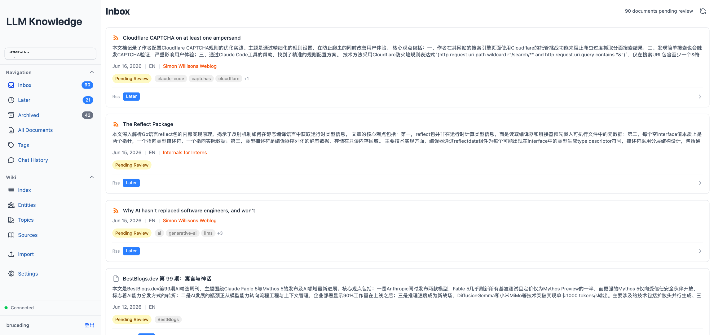

日常阅读中，我们经常遇到这样的场景：在浏览器里看到一篇好文章随手收藏，过阵子却再也找不回来；订阅了一堆 RSS 和 Newsletter，信息反而变成噪音；想回顾一份英文 PDF，又懒得逐页重读。各种收藏夹和稍后读工具都能解决"保存"这一步，却很难真正解决"理解和检索"。

市面上的笔记软件（Notion、Obsidian、Logseq）都强调"双向链接"和"第二大脑"，但它们几乎都要求用户自己去整理、打标签、写笔记。真正能帮你读完、帮你抽取、帮你串起来的工具很少。LLM Knowledge 就是为了解决这个问题而做的小工具。它把内容收集、LLM 抽取、对话问答整合到一套自托管的服务里，下载后跑一个二进制就能用，数据全部落在本地。

下面把它的整体设计、几个关键技术点和主要功能梳理一下。

## 设计约束

在动手写代码之前，先给自己定了几条约束，后面所有的设计都在围绕这些约束做取舍：

| 约束 | 取舍 |
|---|---|
| 自托管优先 | 所有数据都放在本地 `~/.llm-knowledge/` 下，不依赖第三方 SaaS，避免敏感文档外泄 |
| 单文件部署 | 前端 dist 嵌进 Go 二进制，用户拿到一个可执行文件就跑，不用折腾 Node 或 Nginx |
| LLM 能力外挂 | 不自己训模型，也不绑定某个 SDK，把 [Claude CLI](https://docs.anthropic.com/en/docs/claude-code/overview) 当作子进程调用 — 模型升级、换模型、切本地模型，只需要替换 CLI |
| 多源入口收敛 | PDF、网页、RSS、Blog、Newsletter 都走同一条处理链路：原始文件保留，再抽取结构化内容到 Wiki 层 |
| 多用户分区 | 数据按 `users/<id>/` 分区，家人或同事共用一套服务也不串数据 |
| 安全 fail-closed | Claude CLI 是外部进程，但绝不能让它随意读写宿主机文件，必须有沙箱 |

把 LLM 当作子进程而不是 SDK，是这个项目最特别（也最容易被质疑）的设计。它带来的好处是：模型能力完全交给 CLI 本身演进，不用关心 SDK 升级；坏处是必须管理好子进程生命周期，尤其在 HTTP 请求被取消时要及时 `SIGTERM`，避免僵尸进程吃掉配额。后文会详细讲会话池的设计。

## 整体架构

整体结构可以分为四层：客户端、Go 后端、Claude CLI、持久化存储。

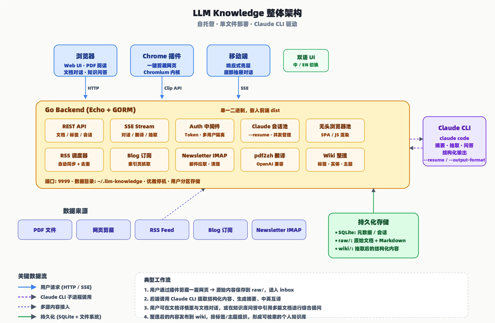

后端用 Go 的 [Echo](https://github.com/labstack/echo) 框架，元数据和会话信息存在 SQLite（用 GORM 管理），文件内容直接落到文件系统。前端是 React 19 + TypeScript + Vite + Tailwind v4，构建产物被 `embed` 进二进制。Claude CLI 以子进程的方式运行，通过 `--output-format stream-json` 拿到结构化输出，再通过 SSE 流式回传给浏览器。

下面这张表把主要模块的角色整理清楚。

| 模块 | 角色 | 实现要点 |
|---|---|---|
| REST API | 文档 / 标签 / 会话 CRUD | Echo 路由 + JSON 响应 |
| SSE Stream | 对话、翻译、LLM 抽取 | 子进程输出流式转发到前端 |
| Auth 中间件 | Token 认证 + 用户隔离 | 请求头或 `?token=` 查询参数 |
| Session Pool | 多用户并发 + `--resume` | 每个会话绑定 session id，优雅停机时回收子进程 |
| 无头浏览器池 | Blog 订阅、剪藏 SPA 页面 | 固定 worker 数，按需启动 chromium |
| RSS / Blog / Newsletter 调度器 | 定时拉取多源内容 | 各自独立 goroutine，自动去重 |
| pdf2zh | PDF 翻译（保留排版） | 独立 venv，OpenAI 兼容 API |
| Wiki 整理 | 标签 / 实体 / 主题聚合 | Claude 在原始文档基础上抽取结构化条目 |

## Doc Chat：一个文档一个子进程

文档对话是最容易被感知的功能：打开一篇文档，点"对话"标签页，可以针对这篇文档问任何问题。看上去只是一个普通的聊天框，但背后藏着整套系统最精细的部分 — **Session Pool + Fan-out 事件分发**。

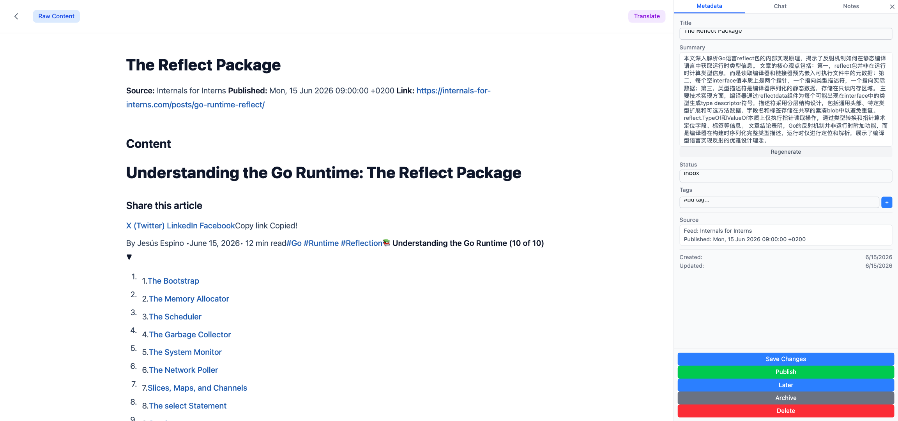

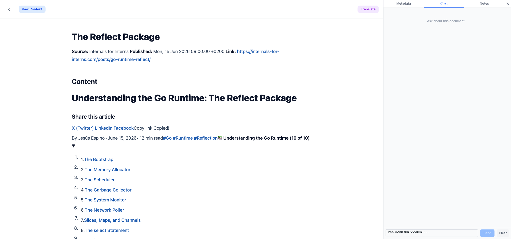

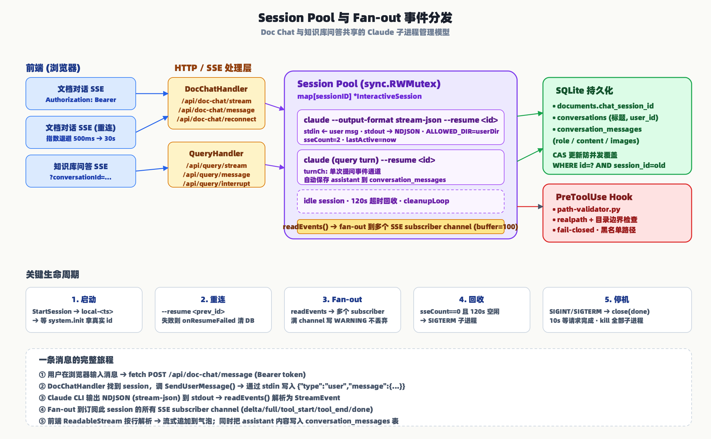

### 为什么不直接调 API

最直觉的做法是：用户发一条消息，后端攒一下上下文，调一次 Claude API，拿到响应再返回。这样做有几个明显的缺点：

1. **每次请求都要重发一遍完整上下文**。文档可能有几万字，反复传输既慢又费钱。
2. **没有真正的"会话"概念**。模型记不住上一轮的语气和结论，需要前端自己拼历史。
3. **无法利用 `--resume`**。Claude CLI 自带会话恢复能力，但 API 调用享受不到。

所以我们选择了另一条路：**为每个打开的文档启动一个长生存期的 Claude CLI 子进程**，通过 stdin/stdout 双向 `stream-json` 通信。会话 id 持久化到 SQLite 的 `documents.chat_session_id` 字段，下次用户再来，用 `--resume <id>` 恢复进程，对话历史对模型来说天然存在。

### 一条消息的旅程

从用户在浏览器敲下回车，到气泡里出现回复，消息会经过这些节点：

1. 浏览器通过 `POST /api/doc-chat/message` 发送消息，带上 Bearer token。
2. `DocChatHandler` 在 Session Pool 里查找这个文档对应的 `InteractiveSession`。
3. 调 `SendUserMessage()`，把 `{"type":"user","message":{...}}` 通过 stdin 写入 Claude 子进程。
4. Claude 边思考边吐 NDJSON 到 stdout，`readEvents()` goroutine 解析为 `StreamEvent`。
5. 事件被 fan-out 到订阅此 session 的所有 SSE subscriber channel（buffer=100），每个 SSE 连接是一个 subscriber。
6. 前端用 `fetch + ReadableStream` 按行解析，把 `delta` / `full` / `tool_start` / `tool_end` / `done` 等事件分发到气泡组件。

事件类型的设计也值得一说。`delta` 是增量文本，用于流式打字效果；`full` 是完整替换，用于 SSE 重连后恢复状态；`tool_start` / `tool_input` / `tool_end` 让前端能展示"正在读 paper.md"这类工具调用过程 — 用户能看见 Claude 在做什么，而不是一个神秘的黑盒。

### 安全沙箱：PreToolUse Hook

让 Claude CLI 在宿主机上读写文件是一件相当危险的事 — 万一模型被 prompt injection 误导，去读 `/etc/shadow` 或者 `~/.ssh/id_rsa` 就糟了。我们用了 Claude CLI 自带的 `PreToolUse` hook 机制来约束它：

1. 每个 Claude 子进程启动时，通过环境变量 `ALLOWED_DIR` 告诉 hook 允许访问的用户目录（`users/<id>/`）。
2. `path-validator.py` 作为 hook，在每次 Read/Write/Edit/Glob/Grep/LS 前被调用。
3. Hook 用 `os.path.realpath()` 消除符号链接，再检查 `resolved.startswith(ALLOWED_DIR + sep)` 防止前缀碰撞（`/data/users/1` 不能匹配 `/data/users/10`）。
4. 敏感路径（`/etc/shadow`、`~/.ssh/`、`~/.aws/`、`~/.kube/`、macOS Keychains 等）列入正则黑名单。
5. **fail-closed 设计**：`ALLOWED_DIR` 没设就拒绝所有访问，绝不开后门。

纵深防御方面，CLI 启动参数里还显式列了 `--disallowedTools Bash,Task,NotebookEdit,SlashCommand`，哪怕 hook 被绕过，命令类工具也跑不起来。WebFetch 工具额外做了 SSRF 防护：scheme 白名单（http/https）+ DNS 解析后 IP 黑名单（loopback/link-local/private/ULA），2s DNS 超时防止 slow-DNS 攻击。

## Wiki Chat：一个 Agent 在文件系统里探险

知识库问答（Query）和文档对话（Doc Chat）看上去都是聊天框，但实现上差异明显：

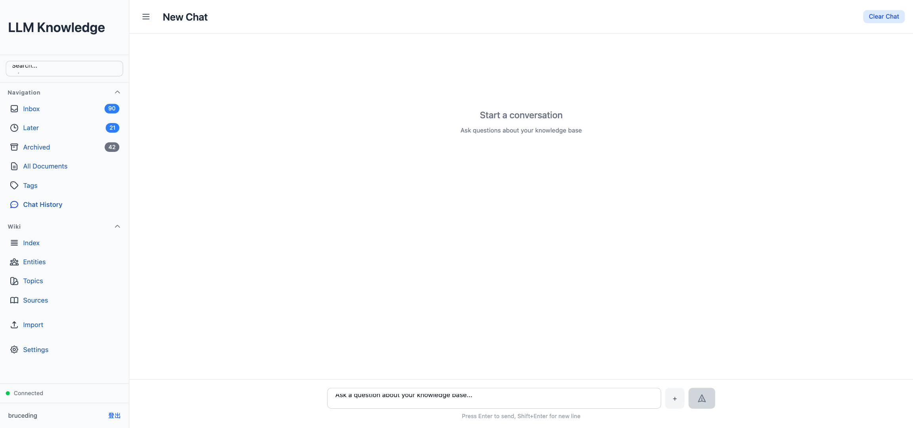

| 维度 | Doc Chat | Wiki Chat |
|---|---|---|
| 子进程粒度 | 一个文档一个 | 一个对话一个 |
| Pool key | `sessionId` (string) | `conversationId` (uint) |
| 允许的 Claude 工具 | `Read` | `Read, Glob, Grep, LS` |
| 上下文来源 | 单篇源文档 | 整个 `wiki/` 目录 |
| 消息自动保存 | 不需要（session 自带记忆） | 每轮 `result` 时写入 `conversation_messages` |
| 中断 | 没有专门 endpoint | `POST /api/query/interrupt` 通过 stdin 写 control_request |

Wiki Chat 的核心想法很直接：**不建向量库，不让用户挑文档**，而是把整个 wiki 目录丢给 Claude，让它自己用 Glob 搜文件、用 Grep 搜关键词、用 Read 读内容，像一个实习生在文件柜里翻找。System Prompt 只告诉它："知识库在 `wiki/`，`wiki/index.md` 是索引，请使用工具回答用户问题"。

这种设计的好处是**完全不用维护向量数据库**，省掉了 embedding 模型、相似度检索、rerank 一堆基建；缺点是对于大型知识库（几千篇文档），Claude 自己探索的效率会下降。目前项目体量还不大，这个权衡是合理的。

## PDF 翻译与双语对照

对于英文论文或报告，LLM Knowledge 提供了一条从"原始 PDF"到"双语对照阅读"的完整路径：

1. **翻译入口**：在文档详情页点 "Translate"，后端调 [pdf2zh](https://github.com/Byaidu/PDFMathTranslate) 生成一份排版保留的译文 PDF。pdf2zh 跑在独立的 Python 3.12 venv 里，走 OpenAI 兼容 API（默认 deepseek-v4-flash，可在设置里改 base / key / model）。
2. **Dual PDF 视图**：翻译完成后，页面顶部出现 "Dual PDF" 标签。点进去左右分屏同时加载原文 PDF 和译文 PDF，两边通过 pdfjs-dist 的 `scroll` / `zoom` 事件做镜像同步 — 滚一边另一边跟着动，缩放比例也保持一致。
3. **Bilingual 视图**：网页剪藏或 Newsletter 等 HTML 类文档翻译后，页面提供 "Bilingual (ZH)" 按钮，点进去是段落级的中英对照视图，更适合快速浏览。
4. **状态管理**：每份翻译任务有独立的状态字段（pending / translating / done / failed），前端通过轮询 `translation-status` 接口拿到进度，避免长连接阻塞。

下面两张截图来自线上版本。第一张是 PDF 类文档的， 点 Dual PDF 标签后原文和译文 PDF 左右并排显示：

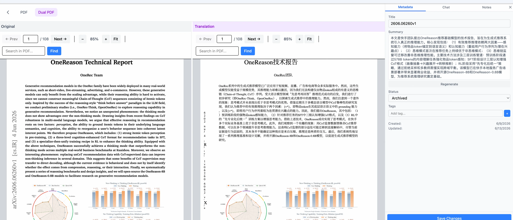

第二张是网页剪藏类文档的 Bilingual (ZH) 视图，段落级中英对照、同步滚动：

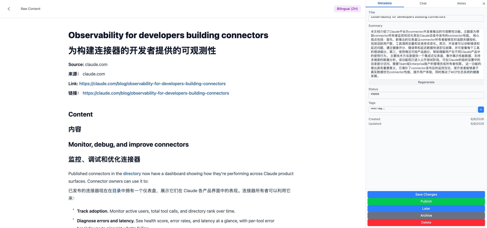

## Wiki 生产：从 Inbox 到结构化知识库

这是整个系统最"魔法"的部分：用户只是上传了一篇 PDF 或剪藏了一篇网页，过一会儿就能在 Wiki 视图里看到一篇带实体、带主题、带互相引用的结构化条目。下图是整条链路。

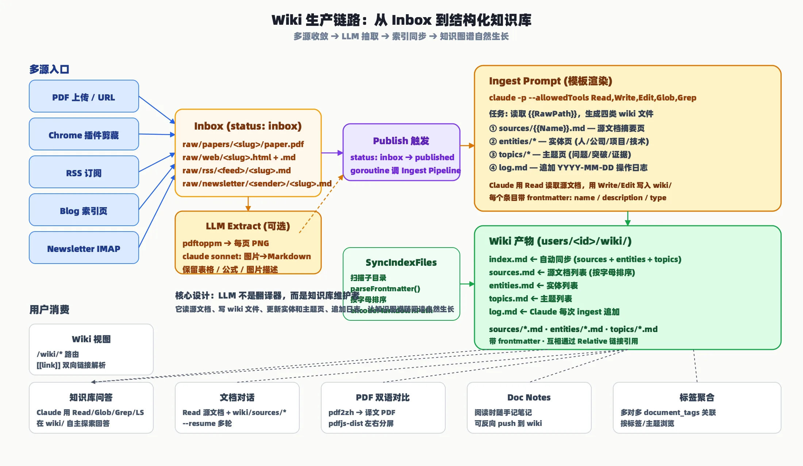

### 多源收敛到 Inbox

不管内容来自 PDF 上传、Chrome 插件剪藏、RSS、Blog 订阅还是 Newsletter IMAP，都先落到 `raw/` 下某个目录，文档状态标为 `inbox`。路径组织方式：

| 来源 | 路径示例 |
|---|---|
| PDF | `raw/papers/<slug>/paper.pdf` + `paper.md` |
| 网页剪藏 | `raw/web/<slug>.html` + `.md` |
| RSS | `raw/rss/<feed>/<slug>.md` |
| Blog | `raw/blog/<feed>/<slug>.md` |
| Newsletter | `raw/newsletter/<sender>/<slug>.md` |

导入页把所有入口整合到一起，五个标签分别对应 PDF 上传、网页剪藏、RSS、Blog、Newsletter，点一下就进 Inbox。

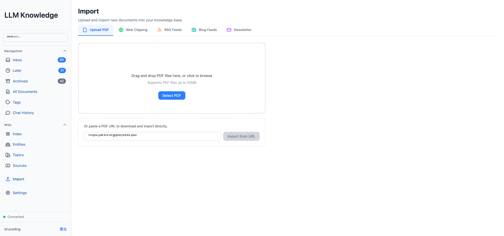

### LLM Extract（PDF 的视觉抽取）

PDF 有时候是扫描版或者复杂排版，`pdftotext` 抽不干净。我们提供了一个可选的 LLM Extract：用 `pdftoppm` 把每页转 PNG，再调 Claude sonnet 把图片识别成 Markdown，保留标题层级、表格、公式、图片占位。这一层完全在临时目录跑，`ALLOWED_DIR` 限定只允许访问这个临时目录，模型没法乱读别的文件。

### Publish 触发 Ingest

用户点击"发布"按钮时，`DocHandler.Publish()` 做三件事：

1. 把文档状态从 `inbox` 改成 `published`。
2. 启动一个 goroutine 调 `ingest.Pipeline.Ingest()`。
3. 等 Ingest 完成后把 `wiki_path` 写回数据库。

Ingest 内部是一次完整的 Claude CLI 调用，prompt 模板大致长这样（节选关键任务）：

```
你是一个知识库维护者。请读取以下源文档，并完成：

## 1. 创建源文档页
在 wiki/sources/<Name>.md 创建：
---
name: <Name>
description: 一句话描述
type: source
---
# 文档标题
## Metadata / Abstract / Key Findings / Core Methods / Limitations / Related

## 2. 创建/更新实体页
在 wiki/entities/ 下，对文中出现的人、公司、项目、技术分别建页：
---
name: 实体名称
description: 一句话描述
type: entity
---
# 实体名称
## Overview / Core Mechanism / Evidence Sources / Related（必须引用 Source）

## 3. 创建/更新主题页
在 wiki/topics/ 下，对文中讨论的主题分别建页：
---
name: 主题名称
description: 一句话描述
type: topic
---
## Problem Statement / Prior State / New Contribution / Evidence Sources / Related

## 4. 追加操作日志
在 wiki/log.md 追加：
- YYYY-MM-DD: 导入 <Name>，创建了 X 个实体，Y 个主题

注意：索引文件由系统自动同步，无需手动更新。Markdown 链接中的空格必须编码为 %20。
```

Claude 被授权 `Read, Write, Edit, Glob, Grep` 五个工具，它会先 Read 源文档，再 Glob 看现有的 entities 和 topics，决定新建还是更新，最后 Write/Edit 落盘。**LLM 不是翻译器，而是知识库维护者** — 这个定位很关键，它让知识图谱能随阅读自然生长，而不是每篇都重写一遍。

### 索引自动同步

Ingest 完成后，`SyncIndexFiles()` 扫描 `sources/`、`entities/`、`topics/` 目录，用 `parseFrontmatter()` 提取每个文件的 `name` 和 `description`，按字母排序后生成 `index.md`、`sources.md`、`entities.md`、`topics.md`。这样 Wiki 视图的入口页永远是最新目录，无需人工维护。

### Wiki 视图

前端用 ReactMarkdown 渲染 wiki 文件，支持 `[[link]]` 双向链接语法。点一个实体名，会跳到对应的 `entities/<name>.md`，页面顶部有面包屑导航，侧边栏有 sources/entities/topics 的快捷入口。随着用户读得越来越多，Wiki 会自然形成一张互相引用的图谱。

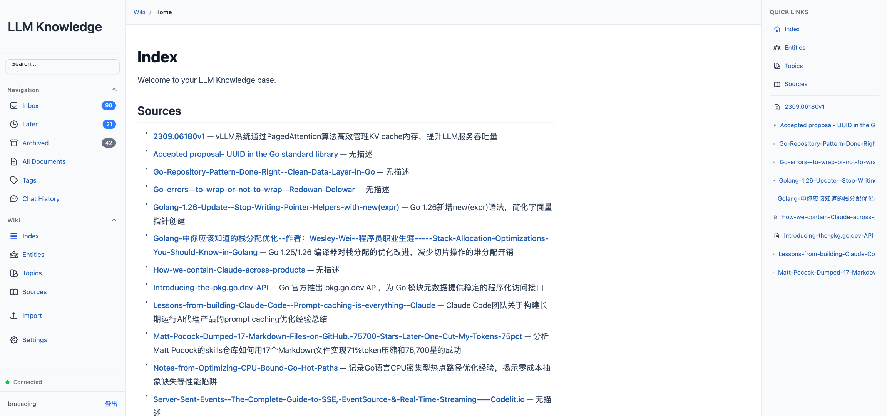

## Chrome 插件：把网页一键收进知识库

浏览器是绝大多数内容的入口，所以我们写了一个 MV3 Chrome 插件（`extension/` 目录），兼容 Chrome、Edge、Brave 等 Chromium 内核浏览器。

### 目录结构

```
extension/
├── manifest.json      # MV3 manifest
├── background.js      # Service Worker
├── content.js         # Content Script（注入页面）
├── options.html/js/css # 设置页
└── icons/
```

权限只申请 `storage`、`activeTab`、`scripting`，够用就好。

### 剪藏流程

1. 用户点击工具栏图标，background service worker 检查 `chrome.storage.local` 里的 wikiUrl 和 token。
2. 先把 Badge 设成灰色 `...`，再 `chrome.scripting.executeScript` 把 content.js 注入到当前 tab。
3. content.js 用 `#js_content`（微信文章！）、`article`、`main`、`[role="main"]`、`.post-content` 等选择器优先匹配正文区域。
4. 克隆节点后移除噪音：`script, style, iframe, nav, header, footer, .ads, .sidebar, .cookie-notice` 等。
5. 返回 `{url, title, html}` 给 background，background POST 到 `/api/raw/web-clip`。
6. 成功把 Badge 设成绿色 ✓，页面底部弹出 Toast；失败设成红色 ✗。
7. 3 秒后清除 Badge。

### 微信文章的特殊处理

`CONTENT_SELECTORS` 数组第一个就是 `#js_content` — 这是微信公众号文章正文的容器 ID。这意味着微信文章会被优先识别并提取正文区域，避开顶部 banner 和底部广告。这个细节看似小，但在中文互联网环境下非常实用。

### 认证

设置页输入 wiki 地址和账号密码，调 `/api/auth/login` 时带 `clientType: 'extension'`，后端会跳过验证码（插件场景不便输入）。Token 存到 `chrome.storage.local`，密码用完立即清空。Token 过期时，后端返回 401，插件把 token 清掉并在 Toast 里提示"登录已过期"，引导用户重新登录。

## 快捷键：键盘党的效率加成

桌面浏览器下有一套 vim 风格的快捷键，输入框聚焦时自动禁用，避免打字时被劫持：

| 场景 | 键位 | 作用 |
|---|---|---|
| 文档详情 | `j` / `k` | 内容向下 / 向上滚动（长按加速） |
| 文档详情 | `g` / `G` | 跳到文档顶部 / 底部 |
| Inbox / Wiki 列表 | `d` | 删除鼠标悬停的文档（弹窗确认） |
| 对话 | `Enter` | 发送消息 |
| 对话 | `Shift+Enter` | 换行 |
| 弹窗 / 搜索 | `Escape` | 关闭弹窗 |
| PDF 阅读器 | `Enter` | 提交搜索 |
| 文档详情 | `Enter` | 添加标签 |

这套快捷键的取舍是：只加高频操作，且尽量和 vim / 浏览器原有习惯一致，让用户不用重新学。

## 其他关键技术点

除了上面重点讲的几块，还有一些值得一提的技术细节：

| 技术点 | 说明 |
|---|---|
| **SSE + NDJSON 流式协议** | Claude CLI 输出 `stream-json`，后端解析后通过 SSE `data:` 帧转发，前端用 `ReadableStream` 手动解析（不用 EventSource，因为要带 Authorization header） |
| **Fan-out 事件分发** | `readEvents()` 把每个事件非阻塞地发到所有 subscriber channel，关键事件（result/error）满 buffer 会打 WARNING 日志，不丢弃 |
| **用户数据分区** | 文件路径 `users/<id>/raw`、`users/<id>/wiki`，DB 查询都带 `user_id` 过滤，迁移工具会把老结构自动搬过去 |
| **路径遍历防护** | 静态文件接口和 Claude 路径验证都做 `filepath.Abs + HasPrefix(absUserDir + sep)`，防止前缀碰撞 |
| **SSRF 防护** | WebFetch scheme 白名单 + DNS 解析后 IP 黑名单，2s DNS 超时 |
| **无头浏览器池** | 固定 2 个 chromium worker，按需启动，用完回收，支持 SPA 页面的 JS 渲染 |
| **PDF 双语分屏同步** | pdfjs-dist 渲染两份 PDF，监听 `scroll` 和 `zoom` 事件做镜像同步 |
| **pdf2zh 独立 venv** | Python 3.12 + qpdf + 中文字体，启动脚本自动检查依赖，缺失时禁用翻译功能并提示 |
| **优雅停机** | 收到 SIGINT/SIGTERM → close(done channel) → 10s 等请求完成 → kill 全部子进程 → 清理临时 security settings 文件 |
| **i18n** | 完整中英文界面，前端 i18n 目录 + 后端错误消息双语化，设置里一行切换 |
| **移动端适配** | 独立壳层，底部抽屉式对话面板，响应式布局 |

## 怎么用起来

启动非常简单：

```bash
git clone https://github.com/bruceding/llm_knowledge.git
cd llm_knowledge
./start.sh
```

`start.sh` 会自动检查 pdftotext、Python 3.12、qpdf，缺的会提示，然后构建前后端并在 `9999` 端口启动。数据默认在 `~/.llm-knowledge/`。自定义端口可以 `PORT=8080 ./start.sh`，开发模式可以 `make dev`（后端 :3456，前端 :5173 热更新）。

首次打开会要求注册账号，登录之后建议先做三件事：

1. 在「导入」页签下配置 RSS 或 Blog 订阅，让系统先把最近的内容拉进来。
2. 安装 Chrome 插件，输入服务地址和账号，之后浏览网页时一键剪藏。
3. 上传一份 PDF，观察 Claude 抽取的结构化内容和摘要，熟悉 Wiki 视图的样子。

之后就可以进入日常循环：看到值得读的内容就剪藏 / 订阅，需要精读时打开文档详情对话，遇到跨文章的问题就去知识库问答。文档整理一段时间后，Wiki 会自然形成自己的主题分类。

如果希望家人也使用，直接在浏览器访问服务地址注册即可，每个用户的数据按 `users/<id>/` 分区，互不影响。

项目代码在 [github.com/bruceding/llm_knowledge](https://github.com/bruceding/llm_knowledge)，欢迎试用、提 issue、或者直接 PR。
