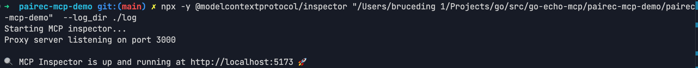

+++
date = '2025-03-30T08:19:50+08:00'
draft = false
title = '使用Mcp Inspector调试MCP Server'
searchHidden = true
ShowReadingTime =  true
ShowBreadCrumbs =  true
ShowPostNavLinks =  true
ShowWordCount =  true
ShowRssButtonInSectionTermList =  true
UseHugoToc = true
showToc = true
TocOpen = false
hidemeta = false
comments = false
description = 'Desc Text.'
disableHLJS = true 
disableShare = false
hideSummary = false

tags = ["mcp","inspector"]

+++

工具的介绍参考[这里](https://modelcontextprotocol.io/docs/tools/inspector)，使用方式也比较简单。 

使用类似的命令，启动服务。 

```bash
npx @modelcontextprotocol/inspector <command>
```

我们使用[前文](../mcp协议解析)提到的 pairec-mcp-demo 作为参考。 

启动命令

```
npx -y @modelcontextprotocol/inspector "/Users/bruceding 1/Projects/go/src/go-echo-mcp/pairec-mcp-demo/pairec-mcp-demo"  --log_dir ./log
```

`/Users/bruceding 1/Projects/go/src/go-echo-mcp/pairec-mcp-demo/pairec-mcp-demo` 是sever 的二进制路径。 

`--log_dir ./log` 中两个是命令行的启动参数。 

启动成功后，会出现如下的提示，浏览器打开相应的地址。 



在打开的页面中，选择 transport type ，确认 command 和 arguments 没有问题后，点击 connect ，会返回连接成功的信息。

连接成功后，如果测试 Tools 功能，选择 Tools tab,  调用 List Tools 方法，会列出 tools 工具，进行测试即可。


