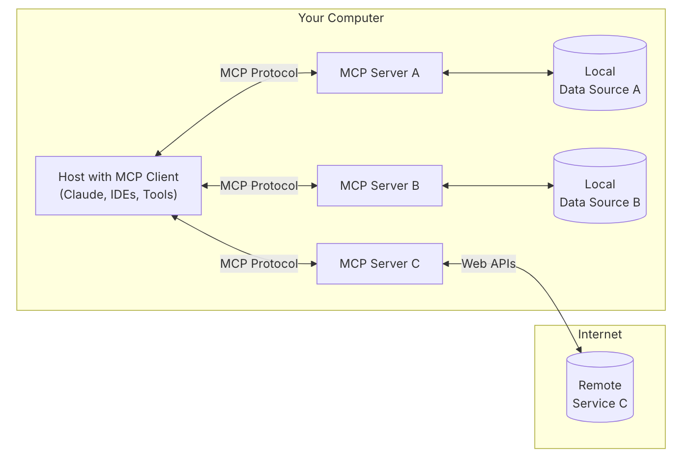
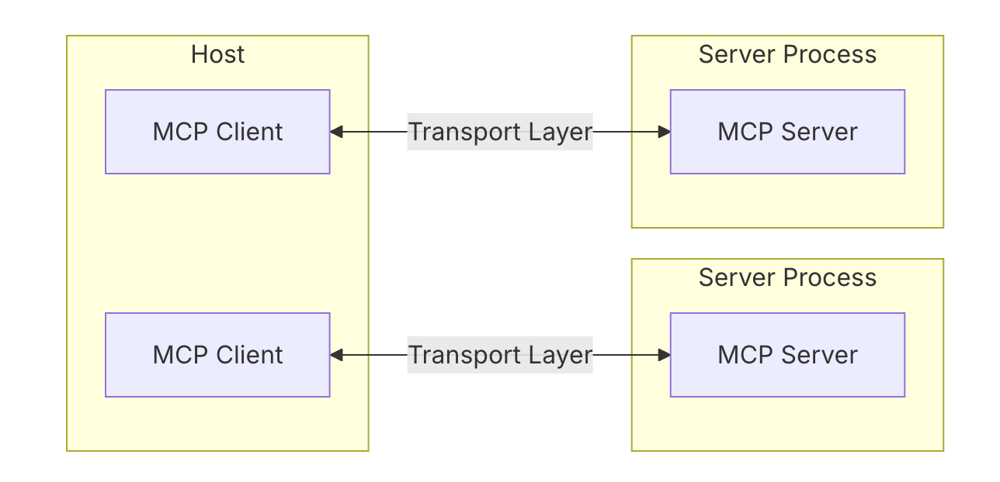
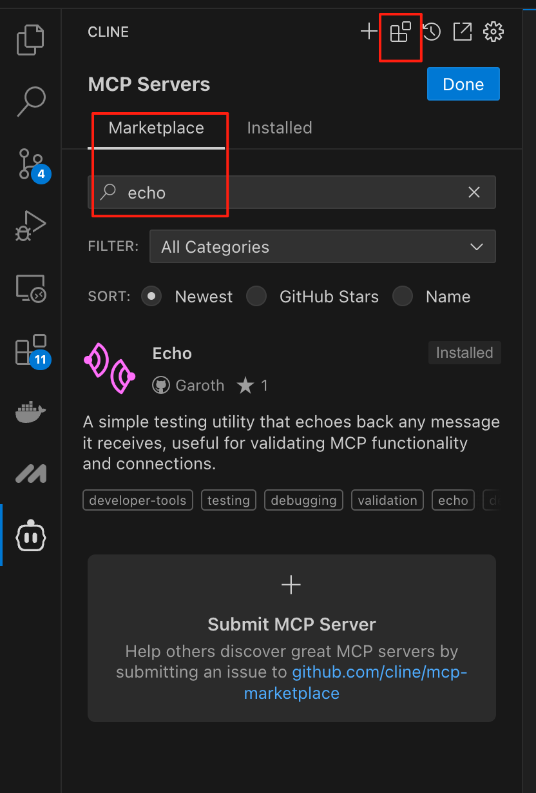
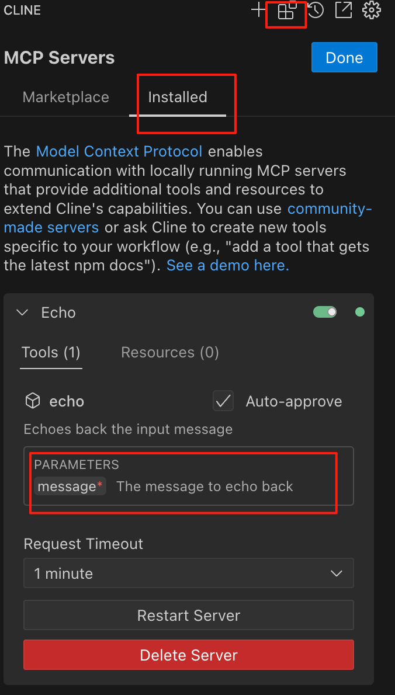
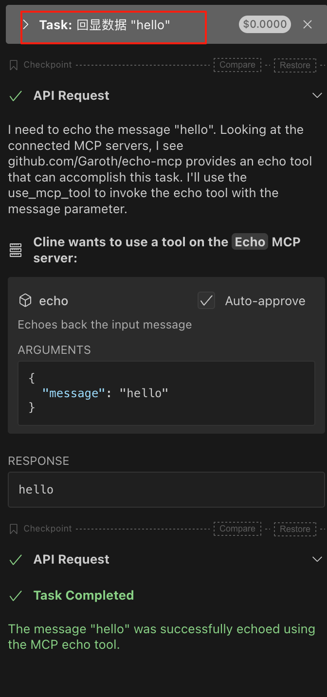
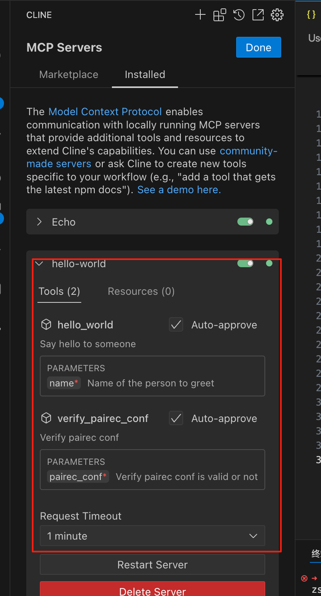
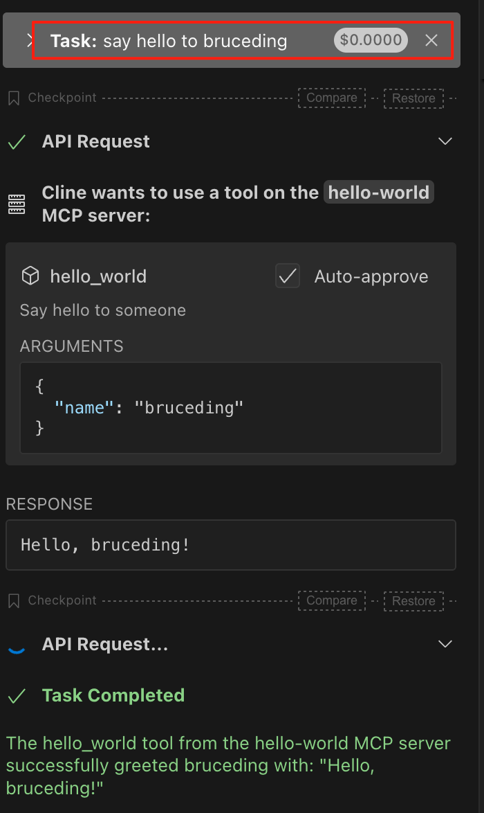
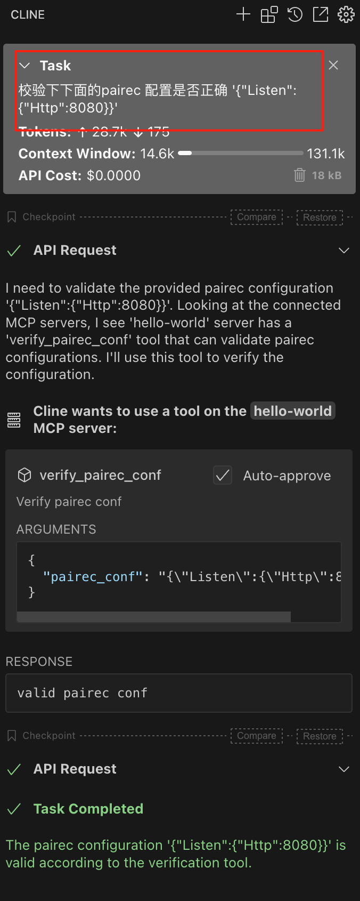

+++
date = '2025-03-20T22:06:00+08:00'
draft = false 
title = 'MCP协议介绍'
searchHidden = true
ShowReadingTime =  true
ShowBreadCrumbs =  true
ShowPostNavLinks =  true
ShowWordCount =  true
ShowRssButtonInSectionTermList =  true
UseHugoToc = true
showToc = true
TocOpen = false
hidemeta = false
comments = false
description = ''
disableHLJS = true 
disableShare = false
hideSummary = false
tags = ["mcp", "llm", "ai"]
+++

MCP(Model Context Protocol,模型上下文协议) 是一个开源的协议，提供了一种通用、标准的方式把LLM AI 大模型和不同数据源以及工具连接起来。类似USB HUB 方式。


与传统调用 API 的方式不同，每个工具都有不同的调用方式，不同的AI 应用或者 LLM 调用时，都需要集成一遍。MCP 的出现，本质上来说出现一个中间层，把工具的提供方和工具的调用方进行了解耦，这样AI应用可以灵活的使用现有已经实现的工具，而不需要单独的集成，提供了开发效率。


## 协议架构



1. MCP HOSTS

面向终端用户的AI 应用，类似 Claude Desktop, IDEs 等通过MCP 协议来访问数据

2. MCP Client

协议的客户端，可以和mcp server 1:1 进行连接。他们之间通过 mcp 协议交互。Client 通常被集成到 host 中。

3. MCP Server

实现了mcp 协议的服务提供方，它会把数据源以及工具的使用通过服务暴露出去。



目前包括两种 transport layer:

1. **Stdio transport**
   * 通过标准的输入输出进行通讯(stdin, stdout)
   * mcp server 运行在本机的进程中，比如 IDE 中的 AI 助手操作本地的终端，或者管理目录和文件等等
2. **HTTP with SSE transport**
   * 使用 SSE 协议进行远程服务通讯
   * 使用http post 请求方式

MCP 的协议是通过 JSON-RPC 2.0的方式来通讯的，具体协议可以参考[这里](https://www.jsonrpc.org/specification)。需要理解消息类型

1. request/response， 一个请求，正确的相应后返回 response , 具体response 业务数据封装在 result 字段中。
2. 当请求出错的情况下，返回的错误信息封装到 error 字段中。
3. 还有一种特殊的请求叫 **Notifications** ， 这个请求不会带RequestId, 也不需要返回响应数据。

在MCP server 的实现中，需要定义好需要提供哪几类数据到client 使用。

1. Resources

   提供数据或者内容到 client ，client 调用LLM 时作为上下文传入。内容形式包括：

   * 图片或者文本信息
   * 数据库的记录
   * 日志文件
   * API 响应数据
   * 截图

   资源被设计为 **application-controlled** ，不同的client 处理资源的方式不同，client 来决定什么时候或者什么方式来作为上下文信息传到 LLM 中。

2. Tools

   这个被设计为 model-controlled。 LLM 主动发起的调用，mcp server 核心的功能点，暴露API 服务实际调用。

3. Prompts

   这个是用户控制的，mcp server 会动态的生成 prompts 发送给用户，用户来决定怎么用。

## 使用 MCP Server

这里[https://modelcontextprotocol.io/clients](https://modelcontextprotocol.io/clients) 列出了很多当前支持 mcp client 的AI 应用或者工具。cline 是vs code 上AI编码的代理，可以通过[B站视频](https://www.bilibili.com/video/BV1AnQNYxEsy/?spm_id_from=333.1387.top_right_bar_window_custom_collection.content.click&vd_source=e91f1e0e2fd6e7afd65d0e39c8cb3c68) 来快速了解cline 是如何使用 mcp server 的。

我们简单通过 echo-mcp-server 来介绍下。 源码参考[这里](https://github.com/Garoth/echo-mcp)。

通过下图参考，进行搜索安装。



安装完成后，自动在 cline_mcp_settings.json 文件中添加启动服务的命令。 这个服务是本机的进程(通过node 命令启动，需要提前安装），通过 stdio transport 通讯的。

```
{
  "mcpServers": {
    "github.com/Garoth/echo-mcp": {
      "command": "node",
      "args": [
        "/Users/bruceding 1/Documents/Cline/MCP/echo-mcp/build/index.js"
      ],
      "disabled": false,
      "autoApprove": [
        "echo"
      ]
    }
  }
}
```

在已安装界面，可以看到名字为 echo 的 Tools， 以及调用时的入参。



我们可以通过输入以下信息，LLM 会自动选择工具，并且封装请求调用echo server 。



## 开发MCP Server

如果我们使用 mcp-go sdk ， 可以很快速的开发 server 服务。go sdk 使用 [mark3labs/mcp-go](https://github.com/mark3labs/mcp-go) 。在这个官方介绍页面，提供了 hello_world 的Tool 的示例。我们根据此示例，可以增加更多的 Tool。

[PAI-Rec 引擎](https://github.com/alibaba/pairec) 是基于JSON配置快速搭建推荐引擎服务的框架。一个正确的json配置文件时服务运行的基石，我们可以提供一个工具来校验json 配置是否正确，并提供相应的建议。这里为了简化，只是简单判断了下 是否是正确的json 格式。

代码如下：

```go
package main

import (
	"context"
	"encoding/json"
	"errors"
	"fmt"

	"github.com/mark3labs/mcp-go/mcp"
	"github.com/mark3labs/mcp-go/server"
)

func main() {
	// Create MCP server
	s := server.NewMCPServer(
		"Demo 🚀",
		"1.0.0",
	)

	// Add tool
	tool := mcp.NewTool("hello_world",
		mcp.WithDescription("Say hello to someone"),
		mcp.WithString("name",
			mcp.Required(),
			mcp.Description("Name of the person to greet"),
		),
	)

	// Add tool handler
	s.AddTool(tool, helloHandler)

	pairecConfTool := mcp.NewTool("verify_pairec_conf",
		mcp.WithDescription("Verify pairec conf"),
		mcp.WithString("pairec_conf",
			mcp.Required(),
			mcp.Description("Verify pairec conf is valid or not"),
		),
	)

	// Add tool handler
	s.AddTool(pairecConfTool, verifyPairecConfHandler)

	// Start the stdio server
	if err := server.ServeStdio(s); err != nil {
		fmt.Printf("Server error: %v\n", err)
	}
}

func helloHandler(ctx context.Context, request mcp.CallToolRequest) (*mcp.CallToolResult, error) {
	name, ok := request.Params.Arguments["name"].(string)
	if !ok {
		return nil, errors.New("name must be a string")
	}

	return mcp.NewToolResultText(fmt.Sprintf("Hello, %s!", name)), nil
}

func verifyPairecConfHandler(ctx context.Context, request mcp.CallToolRequest) (*mcp.CallToolResult, error) {
	conf, ok := request.Params.Arguments["pairec_conf"].(string)
	if !ok {
		return nil, errors.New("pairec_conf must be a string")
	}

	var m map[string]any
	if err := json.Unmarshal([]byte(conf), &m); err != nil {
		return mcp.NewToolResultText(fmt.Sprintf("pairec conf not a valid json format, error:%v!", err)), nil
	}

	return mcp.NewToolResultText("valid pairec conf"), nil
}

```

编译出二进制，我们直接修改 `cline_mcp_settings.json` 文件。 

```
{
  "mcpServers": {
    "github.com/Garoth/echo-mcp": {
      "command": "node",
      "args": [
        "/Users/bruceding 1/Documents/Cline/MCP/echo-mcp/build/index.js"
      ],
      "disabled": false,
      "autoApprove": [
        "echo"
      ]
    },
    "hello-world": {
      "command": "/Users/bruceding 1/Projects/go/src/go-echo-mcp/server/test",
      "args": [],
      "disabled": true,
      "autoApprove": [
        "hello_world",
        "verify_pairec_conf"
      ]
    }
  }
}
```

启动命令是 `/Users/bruceding 1/Projects/go/src/go-echo-mcp/server/test` 。 我们编译出的二进制名称是 test。如果mcp server 启动成功的话，可以看到列出了两个tool， 以及他们的入参是怎样的。



我们可以在cline 对话框中测试下。 首先测试 hello_world 。



再来测试下 verify_pairec_conf 工具。 




## 参考

1. https://norahsakal.com/blog/mcp-vs-api-model-context-protocol-explained/?__readwiseLocation=
2. https://www.bilibili.com/video/BV1AnQNYxEsy/?spm_id_from=333.1387.top_right_bar_window_custom_collection.content.click&vd_source=e91f1e0e2fd6e7afd65d0e39c8cb3c68
3. https://mcp.ad/