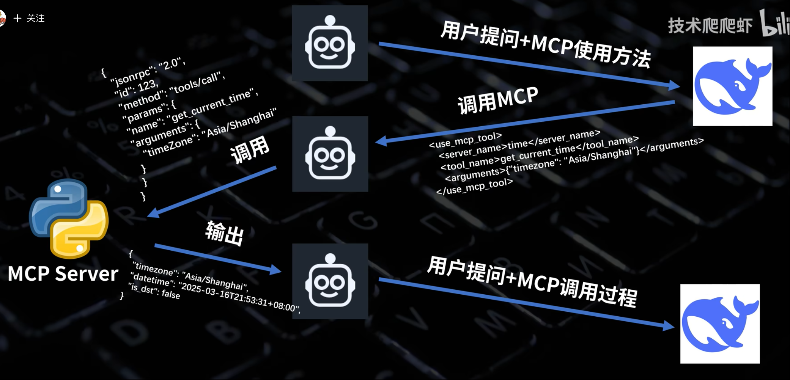
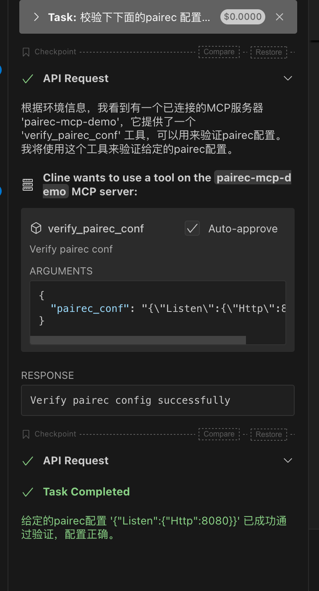

+++
date = '2025-03-27T22:47:55+08:00'
draft = false
title = 'Mcp协议解析'
searchHidden = true
ShowReadingTime =  true
ShowBreadCrumbs =  true
ShowPostNavLinks =  true
ShowWordCount =  true
ShowRssButtonInSectionTermList =  true
UseHugoToc = true
showToc = true
TocOpen = false
hidemeta = false
comments = false
description = 'Desc Text.'
disableHLJS = true 
disableShare = false
hideSummary = false
tags = ["MCP","LLM","AI"]
+++

从[上文](../mcp介绍) 中，介绍了MCP 协议的基本内容，如何使用以及如何基于 stdio transport 开发mcp server 。 本文主要介绍下mcp协议的实现细节。通过从0开始开发一个mcp server, 并且通过日志的方式记录mcp client 和 mcp server 之间的数据是如何交互的。

开发思路是通过 stdio 进行数据读取，然后写入到日志中。注册到 cline 中这样就能接受到 mcp client 的请求了。 通过mcp 协议规范，处理请求，然后返回respone 数据。 处理完一种请求后，不断的更新服务，不断的和mcp client 进行交互，进入下一轮请求，循环往复，直至一个完整的链路完成。 

MCP 协议使用 JSON-RPC格式，具体的request，response schema 可以参考[这里](https://github.com/modelcontextprotocol/specification/blob/main/schema/2025-03-26/schema.json)。 

全部的源码参考[这里](https://github.com/bruceding/pairec-mcp-demo)。

还是使用 Tools 走通整个链路。 下图中可以看出

* Server 启动时，client 就是发起初始化请求，Server 要把相应的能力高速 Client （Resource， Promot, Tool)。
* 假设如果只支持 Tool 能力，client 会发起 tools/list 请求，把所有的工具信息获取到。包括 名称、参数列表、描述等等。
* 如果用户发起了请求， Client 会把用户的提示 + tools 列表信息给到 LLM
* LLM 会选择格式的工具，并组装请求高速 Client
* Client 发起tools/call 调用， mcp server 执行相应的工具功能
* 返回请求后，client 把结果告诉LLM， LLM 进行总结后，输出到客户。 


我们看下核心的代码功能。 实际就是监听标准的输入，解析出 method 方法，然后进行相应的处理。 

```go
package main

import (
	"bufio"
	"encoding/json"
	"flag"
	"fmt"
	"io"
	"os"
	"sync"

	"github.com/golang/glog" // 添加glog导入
)

func main() {

	flag.Parse()
	// 在main函数结束时添加
	defer glog.Flush()

	stdin := os.Stdin
	stdout := os.Stdout

	reader := bufio.NewReader(stdin)

	var wg sync.WaitGroup
	wg.Add(1)
	go func() {
		defer wg.Done()

		for {
			line, err := reader.ReadString('\n')
			if err != nil {
				glog.Error("read from client error", err)
				return
			}
			glog.Info("read from client\t", line, err)
			request := JSONRPCRequest{}
			if err := json.Unmarshal([]byte(line), &request); err != nil {
				glog.Error(err) // 替换fmt为glog
				continue
			}
			switch request.Method {
			case "initialize":
				if response, err := initializeRequest(request); err == nil {
					jsonrpcResponse := JSONRPCResponse{
						JSONRPC: request.JSONRPC,
						ID:      request.ID,
						Result:  response,
					}

					writeResponse(stdout, jsonrpcResponse)

				}
			case "tools/list":
				if response, err := listToolsRequest(request); err == nil {
					jsonrpcResponse := JSONRPCResponse{
						JSONRPC: request.JSONRPC,
						ID:      request.ID,
						Result:  response,
					}

					writeResponse(stdout, jsonrpcResponse)
				}
			case "tools/call":
				if response, err := callToolRequest(request); err == nil {
					jsonrpcResponse := JSONRPCResponse{
						JSONRPC: request.JSONRPC,
						ID:      request.ID,
						Result:  response,
					}
					writeResponse(stdout, jsonrpcResponse)
				} else {
					jsonrpcResponse := JSONRPCResponse{
						JSONRPC: request.JSONRPC,
						ID:      request.ID,
						Error:   err,
					}
					writeResponse(stdout, jsonrpcResponse)
				}
			case "notifications/initialized":
				// do nothing
			default:
				jsonrpcResponse := JSONRPCResponse{
					JSONRPC: request.JSONRPC,
					ID:      request.ID,
					Error: &JSONRPCError{
						Code:    METHOD_NOT_FOUND,
						Message: "not support",
					},
				}
				writeResponse(stdout, jsonrpcResponse)
			}
		}

	}()

	wg.Wait()
}

func writeResponse(writer io.Writer, response JSONRPCResponse) error {
	bytes, err := json.Marshal(response)
	if err != nil {
		return err
	}
	glog.Info("write response\t", string(bytes)) // 替换fmt为glog
	if _, err := fmt.Fprintf(writer, "%s\n", bytes); err != nil {
		glog.Error(fmt.Sprintf("write error, error:%v", err)) // 替换fmt为glog
		return err
	}
	return nil
}

```

可以直接build 出二进制，然后在 client_mcp_settings.json 中注册

```json
{
  "mcpServers": {
    "pairec-mcp-demo": {
      "command": "/Users/bruceding 1/Projects/go/src/go-echo-mcp/pairec-mcp/pairec-mcp-demo",
      "args": [
        "--log_dir",
        "/Users/bruceding 1/Projects/go/src/go-echo-mcp/pairec-mcp/log"
      ],
      "disabled": true,
      "autoApprove": [
        "verify_pairec_conf"
      ]
    }
  }
}
```

command 指向了二进制路径，实际会启动服务。 

args 里增加了log_dir 参数，这样交互的数据可以写入到 log 文件中。下面是完整的交互日志。 `read from client` 是从 stdin 读出的数据，`write response` 是 server 的相应数据。 我们看到initialize，tools/list， tools/call 等方法的调用。

```
I0324 00:53:46.033840   48300 main.go:37] read from client	{"method":"initialize","params":{"protocolVersion":"2024-11-05","capabilities":{},"clientInfo":{"name":"Cline","version":"3.7.1"}},"jsonrpc":"2.0","id":0}
<nil>
I0324 00:53:46.034612   48300 main.go:106] write response	{"jsonrpc":"2.0","id":0,"result":{"protocolVersion":"2024-11-05","instructions":"Hello, welcome to the PAI-Rec MCP server!","capabilities":{"tools":{"listChanged":true}},"serverInfo":{"name":"PAI-Rec MCP Server","version":"1.0.0"}}}
I0324 00:53:46.034999   48300 main.go:37] read from client	{"method":"notifications/initialized","jsonrpc":"2.0"}
<nil>
I0324 00:53:46.035017   48300 main.go:37] read from client	{"method":"tools/list","jsonrpc":"2.0","id":1}
<nil>
I0324 00:53:46.035054   48300 main.go:106] write response	{"jsonrpc":"2.0","id":1,"result":{"tools":[{"description":"Verify pairec conf","inputSchema":{"properties":{"pairec_conf":{"description":"pairec config to verify","type":"string"}},"required":["pairec_conf"],"type":"object"},"name":"verify_pairec_conf"}]}}
I0324 00:53:46.035728   48300 main.go:37] read from client	{"method":"resources/list","jsonrpc":"2.0","id":2}
<nil>
I0324 00:53:46.035752   48300 main.go:106] write response	{"jsonrpc":"2.0","id":2,"error":{"code":-32601,"message":"not support"}}
I0324 00:53:46.035954   48300 main.go:37] read from client	{"method":"resources/templates/list","jsonrpc":"2.0","id":3}
<nil>
I0324 00:53:46.035967   48300 main.go:106] write response	{"jsonrpc":"2.0","id":3,"error":{"code":-32601,"message":"not support"}}
I0324 00:54:29.782929   48300 main.go:37] read from client	{"method":"tools/call","params":{"name":"verify_pairec_conf","arguments":{"pairec_conf":"{\"Listen\":{\"Http\":8080}}"}},"jsonrpc":"2.0","id":4}
<nil>
I0324 00:54:29.783057   48300 main.go:106] write response	{"jsonrpc":"2.0","id":4,"result":{"content":[{"text":"Verify pairec config successfully","type":"text"}]}}
I0324 23:56:42.371421   48300 main.go:37] read from client	{"method":"tools/list","jsonrpc":"2.0","id":5}
<nil>
I0324 23:56:42.372782   48300 main.go:106] write response	{"jsonrpc":"2.0","id":5,"result":{"tools":[{"description":"Verify pairec conf","inputSchema":{"properties":{"pairec_conf":{"description":"pairec config to verify","type":"string"}},"required":["pairec_conf"],"type":"object"},"name":"verify_pairec_conf"}]}}
I0324 23:56:42.388506   48300 main.go:37] read from client	{"method":"resources/list","jsonrpc":"2.0","id":6}
<nil>
I0324 23:56:42.388547   48300 main.go:106] write response	{"jsonrpc":"2.0","id":6,"error":{"code":-32601,"message":"not support"}}
I0324 23:56:42.392039   48300 main.go:37] read from client	{"method":"resources/templates/list","jsonrpc":"2.0","id":7}
<nil>
I0324 23:56:42.392080   48300 main.go:106] write response	{"jsonrpc":"2.0","id":7,"error":{"code":-32601,"message":"not support"}}
I0327 23:57:48.840123   48300 main.go:37] read from client	{"method":"tools/list","jsonrpc":"2.0","id":8}
<nil>
I0327 23:57:48.847155   48300 main.go:106] write response	{"jsonrpc":"2.0","id":8,"result":{"tools":[{"description":"Verify pairec conf","inputSchema":{"properties":{"pairec_conf":{"description":"pairec config to verify","type":"string"}},"required":["pairec_conf"],"type":"object"},"name":"verify_pairec_conf"}]}}
I0327 23:57:48.849099   48300 main.go:37] read from client	{"method":"resources/list","jsonrpc":"2.0","id":9}
<nil>
I0327 23:57:48.849136   48300 main.go:106] write response	{"jsonrpc":"2.0","id":9,"error":{"code":-32601,"message":"not support"}}
I0327 23:57:48.849404   48300 main.go:37] read from client	{"method":"resources/templates/list","jsonrpc":"2.0","id":10}
<nil>
I0327 23:57:48.849429   48300 main.go:106] write response	{"jsonrpc":"2.0","id":10,"error":{"code":-32601,"message":"not support"}}
I0327 23:58:47.913358   48300 main.go:37] read from client	{"method":"tools/call","params":{"name":"verify_pairec_conf","arguments":{"pairec_conf":"{\"Listen\":{\"Http\":8080}}"}},"jsonrpc":"2.0","id":11}
<nil>
I0327 23:58:47.915518   48300 main.go:106] write response	{"jsonrpc":"2.0","id":11,"result":{"content":[{"text":"Verify pairec config successfully","type":"text"}]}}

```

在上面的整体链路的描述中，也可以看这里的[视频](https://www.bilibili.com/video/BV1P3XTYPEJm?spm_id_from=333.788.recommend_more_video.-1&vd_source=e91f1e0e2fd6e7afd65d0e39c8cb3c68)更快速的理解。



从下面的截图中，也比较方便的看出整个的过程。 


