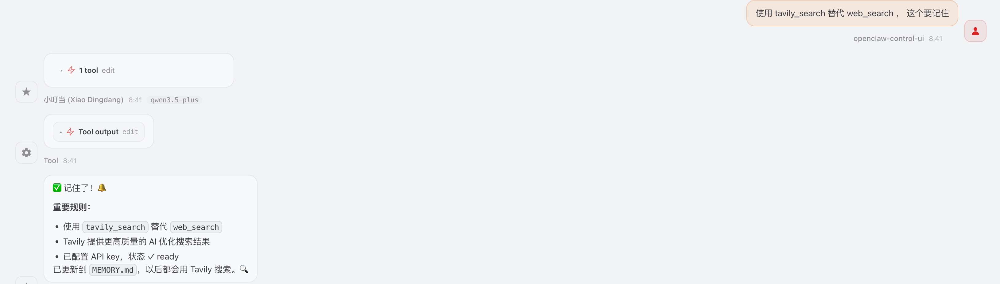

+++
date = '2026-03-15T07:08:00+08:00'
draft = false 
title = 'OpenClaw 阿里云ECS部署指南'
searchHidden = true
ShowReadingTime =  true
ShowBreadCrumbs =  true
ShowPostNavLinks =  true
ShowWordCount =  true
ShowRssButtonInSectionTermList =  true
UseHugoToc = true
showToc = true
TocOpen = false
hidemeta = false
comments = false
description = ''
disableHLJS = true 
disableShare = false
hideSummary = false
tags = ["OpenClaw", "Alibaba Cloud", "ECS", "AI Agent"]
+++

## 什么是 OpenClaw？

OpenClaw（原名Clawdbot、Moltbot）是一款开源的本地优先AI代理与自动化平台。它不仅能像聊天机器人一样对话，更能通过自然语言调用浏览器、文件系统、邮件等工具，完成整理文档、处理邮件、安排日程等实际任务，像一个"能替你干活的AI数字员工"。

OpenClaw的核心特点包括：
- **多渠道集成**：支持企业微信、QQ、钉钉、飞书四大国内主流IM
- **持久记忆**：拥有长期记忆能力，可以记住用户偏好和历史交互
- **主动执行**：能够主动执行任务，如发送邮件、管理文件等
- **开源可定制**：完全开源，可以根据业务需求进行深度定制

## ECS 部署 OpenClaw
本文介绍如果在阿里云的ECS 上部署原生的OpenClaw。使用的是Alibaba Clound 系统。 如果直接用OpenClaw提供的shell 进行部署的话，可能会不识别这个系统而失败。

首先手段安装 npm 包。 

```shell
yum install npm 
```

后面部署比较简单，直接使用OpenClaw 的方案即可。 

```shell
curl -fsSL https://openclaw.ai/install.sh | bash
```

成功后可以直接使用 `openclaw -h` 命令查看相关的功能。 首先进行初始化配置的话，使用 `openclaw onboard` 。这里可以比较简单，只需要配置模型搞好就行。 其余的过程可以直接skip 。 模型配置好后，服务能启动之后，那么直接可以通过对话的方式，让openclaw 自己配置了。 

配置好了之后，通过 `openclaw  dashboard` 来查看如何登录web ui 。我们相当于在本地去访问云上的 ecs 的 openclaw, 需要在本地终端打开 `ssh -N -L 18789:127.0.0.1:18789 root@ecs公网IP` 。 openclaw 的默认端口是18789, 这个时候需要在阿里云的安全组上开启这个端口，当然，为了安全，可以限制本机出口的IP 。

如果全部配置好了后，本地浏览器上输入 `127.0.0.1:18789 ` 就可以访问了。  

## 与钉钉集成
如果成功登录了openclaw 的web ui, 后续的配置，可以交由openclaw 自动完成了。 

openclaw 一个核心特性就是多channel 的集成，本文介绍如何与钉钉集成。 

集成方式也比较简单，根据 [这里](https://github.com/DingTalk-Real-AI/dingtalk-openclaw-connector) 直接让 openclaw 配置就好了。 openclaw 本身能通过web_fetch获取网页的内容，跟着 openclaw 的提示一步步做就好了。 

如果成功了，就可以通过钉钉的机器人或者应用，使用openclaw 了。 但是一开始只支持文本的发送，当发送图片时，openclaw 并不能很好的识别。 

解决方案是通过百炼的视觉模型来解决。 
1. 首先让claw自动配置下imageModel， 使用的模型是 `qwen-image-2.0-pro`。
2. 然后自建了skill， 当遇到图片时，可以发送到这个模型进行内容的识别。 skill 名称是 `image-vision`, 描述是 `使用阿里云 qwen-image-2.0-pro 视觉模型识别图片内容。当用户发送图片或需要识别图片时自动触发，支持 PNG/JPG/GIF/WebP 格式，可识别文字、物体、场景、布局等。` 

这样钉钉上发送图片，就可以识别了。 

## 使用skill和记忆
openclaw 强大的一个特性就是支持 skill 。 当遇到一个通用的问题，或者可重复的解决问题时，可以直接使用 skill-creator 来创建自定义的 skill 。 

openclaw 提供的web_search 是使用 Brave API， 但是开通 Brave 服务需要银行卡等信息，这个并不友好。 我们可以使用 [tavily](https://app.tavily.com/home) 开通使用，来替换 Brave 。

那么可以安装skill 来使用 tavily，比如[framix-team-openclaw-tavily-tavily-search](https://lobehub.com/zh/skills/framix-team-openclaw-tavily-tavily-search?activeTab=skill) 或者 [openclaw-tavily-search](https://clawhub.ai/Jacky1n7/openclaw-tavily-search) 。 配置好了之后，如果 openclaw 还是用Brave 搜索的话，可以明确告诉 openclaw 让它记住。  




## 参考资料

- OpenClaw官网：https://openclaw.ai/
- 阿里云百炼：https://www.aliyun.com/benefit/scene/codingplan
- 阿里云OpenClaw部署专题：https://www.aliyun.com/activity/ecs/clawdbot