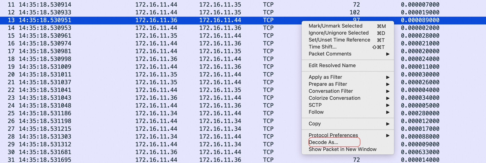
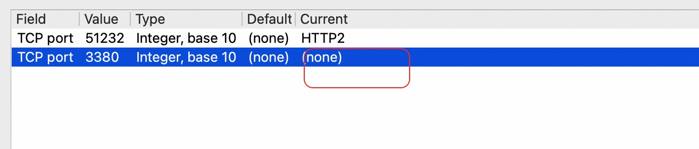
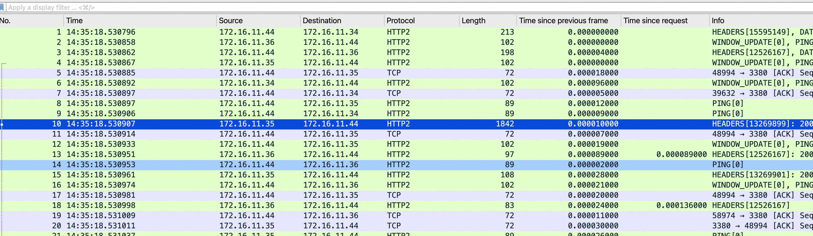
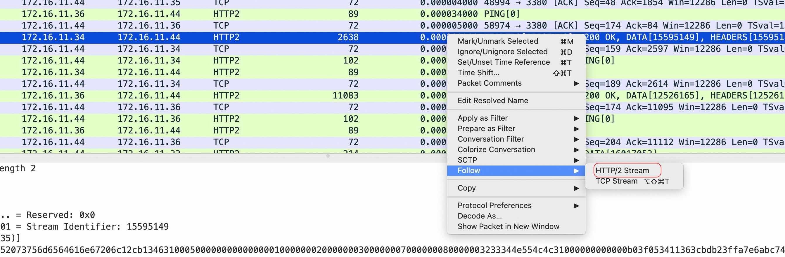
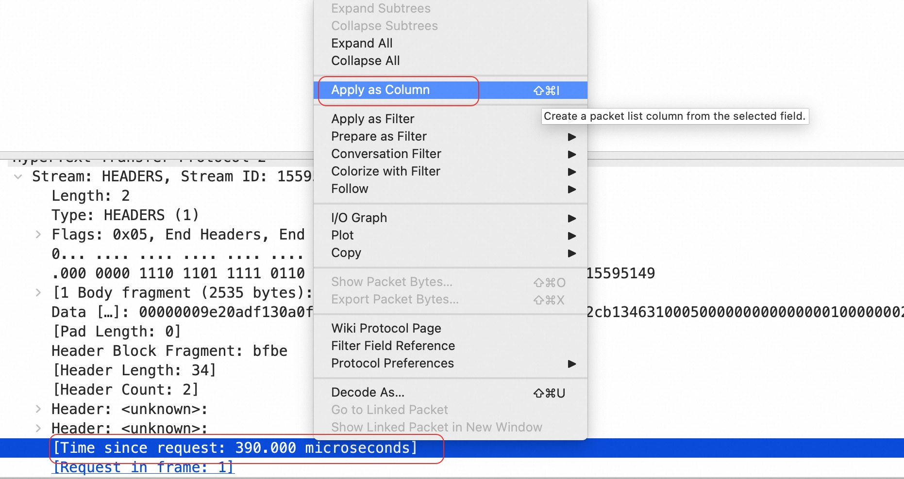
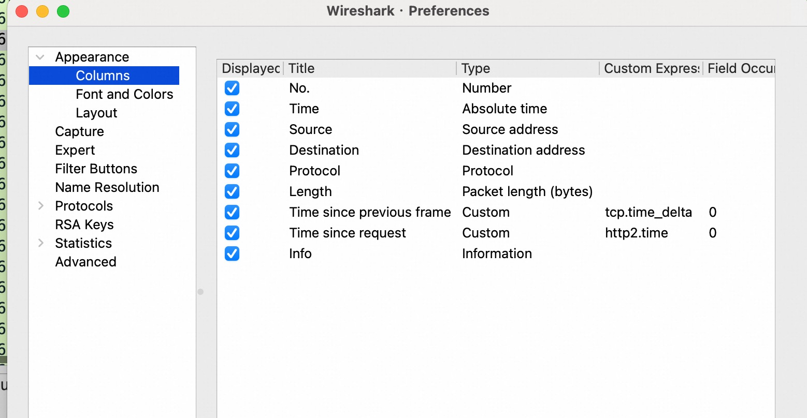
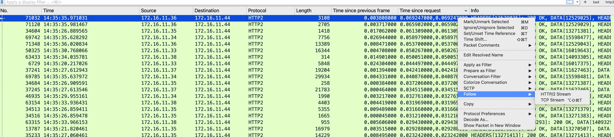
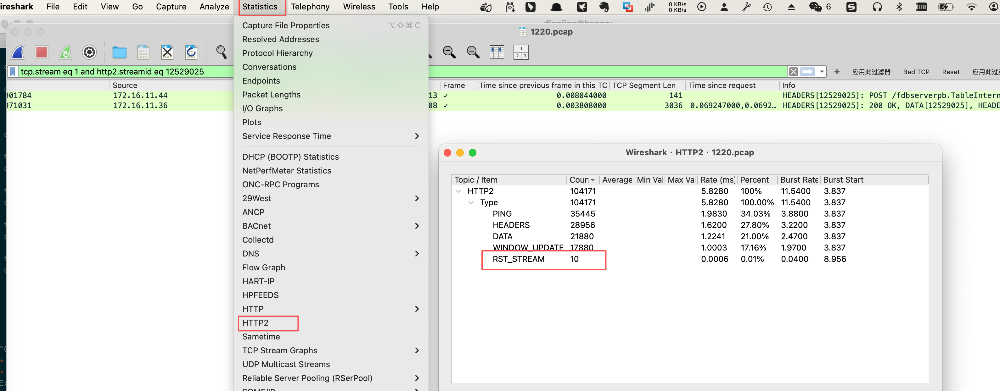
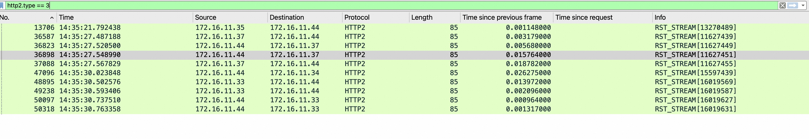
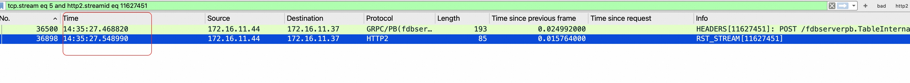

+++
date = '2025-12-21T16:07:05+08:00'
draft = false 
title = '使用Wireshark分析gRPC'
searchHidden = true
ShowReadingTime =  true
ShowBreadCrumbs =  true
ShowPostNavLinks =  true
ShowWordCount =  true
ShowRssButtonInSectionTermList =  true
UseHugoToc = true
showToc = true
TocOpen = false
hidemeta = false
comments = false
description = ''
disableHLJS = true 
disableShare = false
hideSummary = false
tags = ['grpc', 'wireshark']
+++

本文介绍如何使用Wireshark来分析gRPC协议的网络通信，当遇到性能问题或者网络问题时，通过分析gRPC的网络包可以提供一种定位问题的方式。

当我们抓取grpc的网络数据之后，使用wireshark 打开后，默认显示的是TCP 协议。我们知道grpc 是基于http2 协议的，需要使用http2进行分析。可以任选一个包，右击进行编码选择。

在我们场景中，3380 是grpc 的server 端口，这里也把 Current 选择为HTTP2 。

确定后，协议变了，同时显示的内容也回把grpc的协议信息也显示出来了。

当我们定位任一个HTTP2的包，右击选择 HTTP2 Stream， 就可以看到具体某个stream 的信息了。 由于grpc 使用了 http2协议，多个grpc 请求时共用一个tcp 连接的，但是不同的请求会使用不同的stream 进行区分。 不能像http 那样，在同一个tcp连接上，请求时顺序的，一个请求结束再去处理下一个请求。

打开具体某个stream后，可以在窗口下方找到如下的信息。把Time since request 应用为新列。

这个时间实际是用http2.time 字段来计算的。它的逻辑是：
当前这一帧的时间 减去 该 Stream ID 起始帧（即客户端发送的 HEADERS 请求帧）的时间。简单来说：
* 对于服务器返回的第一个响应包： http2.time = 服务器处理耗时 + 网络往返延迟。
* 对于服务器返回的最后一个响应包（Trailers）： http2.time = 该 RPC 请求从发起到彻底结束的总耗时。

通过窗口的 Edit Column， 是可以看到Time since request 定义为 http2.time 的。

通过http2.time就可以分析 server 返回的响应耗时。我们对 Time since request 进行排序。倒序后，找到相应最大的包，进行Flow http2 strem 进行分析。而且可以看到， server 的响应的耗时分布。

根据上面的http2.time定义，这里找到的确实是server 耗时最长的一个请求。但这个是最终结果吗？在很多情况下，在进行grpc调用时，我们会设置超时时间。那如果超时了，网络请求会怎么样呢？如果超时的话，client 会直接把这个stream 断开，而实际上server 无法返回数据，没有响应，那么就无法计算http2.time 了。

我们可以通过分析HTTP2 来得到更多的信息。 从结果看到，有少量的 RST_STREAM 帧。 我们需要把这些帧找到，进一步分析。 

我们可以通过 http2.type==3 来过滤出来，然后通过Follow http2 stream 来分析整个stream 。 

从下图可以看到，server 一直没有返回响应，RST_STREAM 也是client 发起的。但我们可以看这两个帧的时间间隔，基本在 80ms（接口超时时间是 80ms），那么符合我们的推断。也就是说，RST_STREAM 就是接口超时的表现。

那么从整个包分析来说，是存在少量的接口调用超时的情况的。

