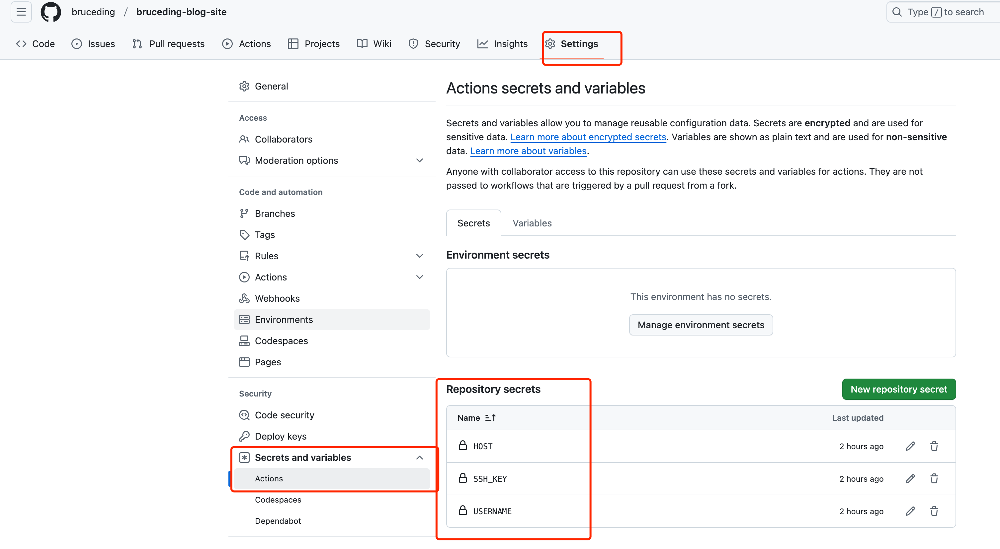

+++
date = '2025-02-12T20:38:52+08:00'
draft = false 
title = '使用hugo搭建blog'
+++

本文介绍如何使用 hugo 搭建静态网站，网站内容push 到 github 上，通过 github action 编译然后传到 linode 机器上，通过nginx 服务访问网站内容。

hugo 的使用参考[这里](https://github.com/gohugoio/hugo). 

首先进行 hugo 安装， 本地电脑室mac ，通过 brew 安装
```
brew install hugo
```
然后创建一个网站, 会创建这个目录。
```
hugo new site bruceding-blog-site
```
进入 bruceding-blog-site 目录中 ，进行 git 初始化。
```
cd bruceding-blog-site
git init    
```
添加主题
```
git submodule add https://github.com/nanxiaobei/hugo-paper themes/paper
echo "theme = 'paper'" >> hugo.toml
```
在github 上创建一个仓库，名字为 bruceding-blog-site。
然后把本地的仓库和github 上的仓库关联起来。
```
git remote add origin git@github.com:bruceding/bruceding-blog-site.git
```
新建一个blog 文章 
```
hugo new content content/posts/使用hugo搭建blog.md
```
会生成类似的文件头, 把 draft 改成 false 。否则不会生成html 文件。 
```
+++
date = '2025-03-02T20:38:52+08:00'
draft = false 
title = '使用hugo搭建blog'
+++
```
在写blog 时，经常会用到图片的引用。我们在 content/posts 目录下创建 images 目录，所有的图片统一放到这里。那么 posts 下的blog 可以直接通过 `./images/image-xxx.png` 引用。

我们写完blog ，git push 当 github 上时，可以通过 github action 编译生成静态网站，并推送到部署服务器上。
github action 写在 `.github/workflows/hugo.yml` 文件，内容参考如下：
```
# Sample workflow for building and deploying a Hugo site to GitHub Pages
name: Deploy Hugo site to Pages

on:
  # Runs on pushes targeting the default branch
  push:
    branches: ["main"]

  # Allows you to run this workflow manually from the Actions tab
  workflow_dispatch:

# Sets permissions of the GITHUB_TOKEN to allow deployment to GitHub Pages
permissions:
  contents: read
  pages: write
  id-token: write

# Allow only one concurrent deployment, skipping runs queued between the run in-progress and latest queued.
# However, do NOT cancel in-progress runs as we want to allow these production deployments to complete.
concurrency:
  group: "pages"
  cancel-in-progress: false

# Default to bash
defaults:
  run:
    shell: bash

jobs:
  # Build job
  build:
    runs-on: ubuntu-latest
    env:
      HUGO_VERSION: 0.128.0
    steps:
      - name: Install Hugo CLI
        run: |
          wget -O ${{ runner.temp }}/hugo.deb https://github.com/gohugoio/hugo/releases/download/v${HUGO_VERSION}/hugo_extended_${HUGO_VERSION}_linux-amd64.deb \
          && sudo dpkg -i ${{ runner.temp }}/hugo.deb
      - name: Install Dart Sass
        run: sudo snap install dart-sass
      - name: Checkout
        uses: actions/checkout@v4
        with:
          submodules: recursive
      - name: Build with Hugo
        env:
          HUGO_CACHEDIR: ${{ runner.temp }}/hugo_cache
          HUGO_ENVIRONMENT: production
        run: |
          hugo \
            --minify \
            --baseURL "https://bruceding.me/"
      - name: Deploy
        uses: appleboy/scp-action@v0.1.7
        with:
          host: ${{ secrets.HOST }}
          username: ${{ secrets.USERNAME }}
          key: ${{ secrets.SSH_KEY }}
          source: "./public/"
          target: "/usr/share/nginx/bruceding-blog/"

```
上面的逻辑比较简单，通过 hugo 生成内容，内容在 public 文件中，然后通过scp 命令推送到服务其上。上面的baseURL 配置域名，target 指定服务器上的目录。
scp 的action 使用可以参考 [这里](https://github.com/appleboy/scp-action)。

上面配置的 secrets.xx 环境变量，可以通过 github 页面上配置。



`hugo.toml` 中的内容配置如下， 主要设置好 baseURL 。

```cat hugo.toml
baseURL = 'https://bruceding.me/'
languageCode = 'en-us'
title = 'BruceDing’s blog'
theme = 'paper'
```

那么进行 push 推送后，在linode 服务器上的 `/usr/share/nginx/bruceding-blog/` 会包含 public 文件。需要配置nginx 文件。

主要配置如下：

```
# 指定网站根目录
 root         /usr/share/nginx/bruceding-blog/public;
# image 路径文件改写
# 处理特定路径的重定向
location ~ ^/posts/.*/images/(image-.*)$ {
    rewrite ^/posts/.*/images/(image-.*)$ /posts/images/$1 break;
 }

```

在 public 目录下会有 images 文件，我们所有的图片都统一放到了这里。但是我们在 md 文件中，针对md 文件进行了 `./images/image-xx` 的引用，我们需要进行下路径改写。

nginx 网站正常启动后，只是提供了 http 服务，可以通过Let's Encrypt 和 Certbot 安装免费的证书，使其可以使用https 协议。

```
sudo yum install epel-release
sudo yum install certbot python3-certbot-nginx
sudo certbot --nginx
```

