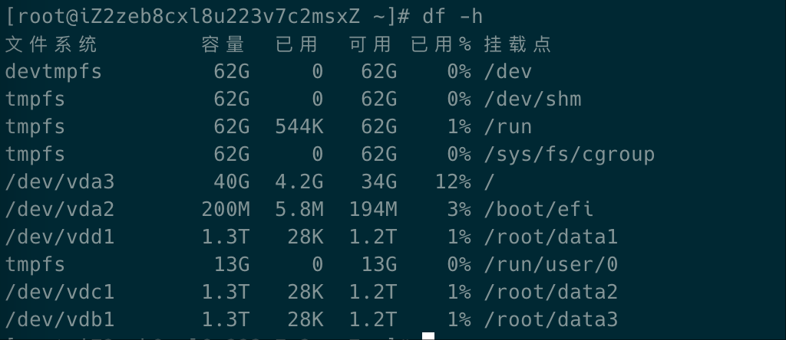
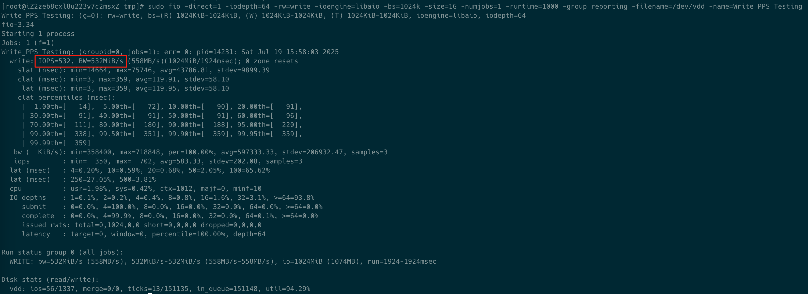
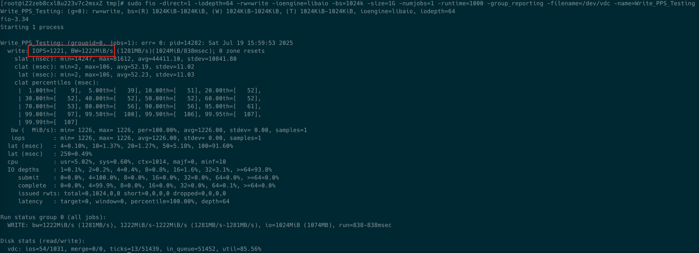
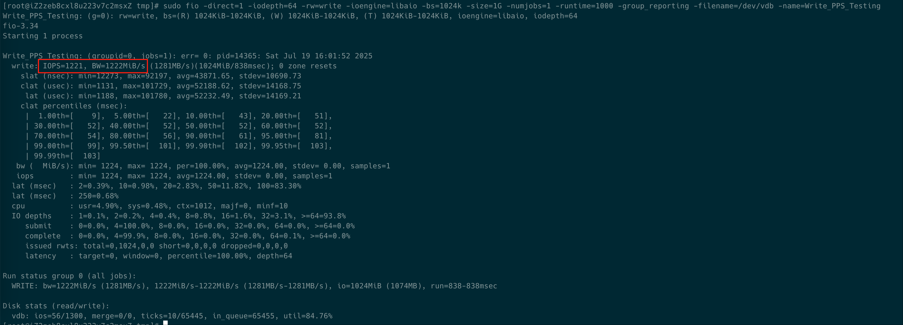
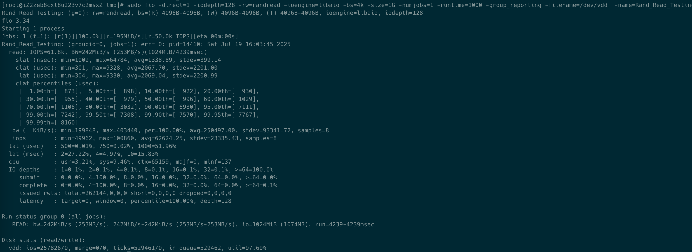
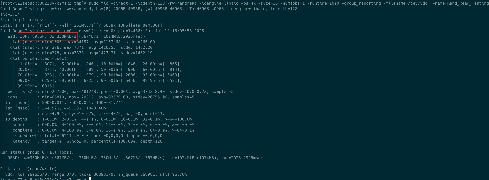
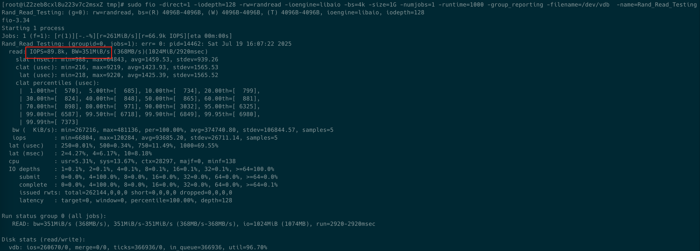

+++
date = '2025-07-19T15:38:42+08:00'
draft = false 
title = '阿里云云盘性能测试'
searchHidden = true
ShowReadingTime =  true
ShowBreadCrumbs =  true
ShowPostNavLinks =  true
ShowWordCount =  true
ShowRssButtonInSectionTermList =  true
UseHugoToc = true
showToc = true
TocOpen = false
hidemeta = false
comments = false
description = ''
disableHLJS = true 
disableShare = false
hideSummary = false
+++
应用服务对磁盘的使用基本模式是顺序写，随机读。通过具体的ECS来测试下云盘的性能。
测试ECS机型ecs.r7.4xlarge（16核128G）
分别测试三种磁盘性能PL1, PL2, PL3 大小都是一样，1300G。选择 1300G 主要是 PL3 有磁盘的最小限制。
挂载之后

PL1 挂载到 /root/data1
PL2 挂载到 /root/data2
PL3 挂载到 /root/data3
挂载之后重启实例进行测试。测试方法参考[阿里云官方文档](https://help.aliyun.com/zh/ecs/user-guide/test-the-performance-of-block-storage-devices?spm=a2c4g.11186623.help-menu-25365.d_4_3_5_2.3bf716f9QJyzz4)。

### 顺序写测试
PL1 顺序写性能

PL2 顺序写性能

PL3 顺序写性能

### 随机读测试
PL1 随机读性能

PL2 随机读性能

PL3 随机读性能

### 结论
PL2/PL3 比 PL1 有比较好的性能。因为1300G 已经超过了 PL1 本身的性能限制。PL2和PL3 是相差不大的。但是PL3 会支持更大的磁盘，如果磁盘容量更大的话，选择PL3。
在时延上，PL2 也比 PL1 有比较大的提升。

